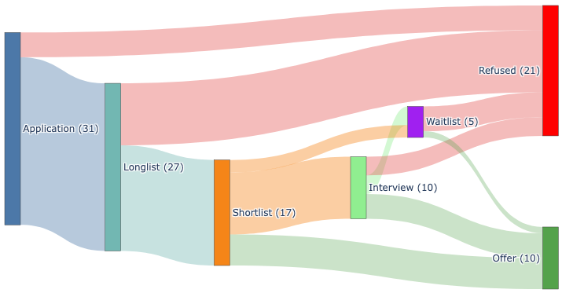

Having just gone through the gruelling experience of applying for postdoctoral positions, I wanted to jot down a few lessons learned and reflections. I will try to focus on what I personally was surprised by and would have liked to know a little ahead of time. I will primarily cover things that I did not really find elsewhere (e.g., make sure you have good letter writters).

I will also preface this by saying that my experiences are of course mainly applicable to others in astronomy/AI for Science. I also would like to encourage people who have questions to reach out at [ckragh [at] princeton.edu](mailto:ckragh@princeton.edu) (or whichever email I have when you are reading this).

## What kind of postdoctoral positions exist?

One thing that was not that clear to me ahead of time was the different kinds of postdoctoral positions that one can apply to, and I was pretty surprised with some of the things. In the end, I constructed four broad categories (that others are free to disagree with), with some potential sub-divisions. I will list these in order of average likelihood of an application succeeding. 

- Society of Fellows - positions:
(Short explanations of what a society of fellows is and how this is only at big, prestigious institutions). These took me completely by surprise, the sheer mafia-like structure, you can only apply when you are nominated thing seems shockingly old-fashioned. That being said, if you do get one of them, you will be very well taken care of. Most Societies have regular meals together, allowing Junior and Senior Fellows to interact. Partially because many Senior Fellows or other Senior Faculty Members will be forced to spend significant of time with you, the selection process is very thorough. The two places I interviewed (the Simons Society and MIT's Pappalardo Fellowship) had day-long visits with many one-on-one meetings, chalk talks in front of a committee of ~15 senior professors, and either a dinner or luncheon with the committee. It is quite exhausting, but also quite enjoyable! 
As an aside, these are the most insider/old boys club things that I have ever encountered in my academic life. You have to be nominated to even apply, and typically the nominator has to be a very senior/famous person. These are also not advertised very clearly (so you will only find them if somebody you know makes you aware of them), to the point where several Junior Faculty members (even at Princeton) did not know that they existed. 

- Large-scale program - positions:
Hubble, Brinson, Schmidt AI for Science, 

- Institutional (Prize) Fellowships:
Many institutions call their normal postdocs "Fellows" now which has diminished the title of "Fellow" quite a lot. In the upper echelon of these we have what is called named Fellowships (e.g., the Schwarzschild-Fraunhofer at LMU (add link) or the Spitzer (add link) at Princeton) or "Prize" Fellowships (e.g., the SkAI Prize Postdoc Fellowship).  On the lower echelon, we find institutional fellowships, like the KIPAC fellowship at Stanford (add link) or the Flatiron Research Fellowship (add link). However, I cannot stress enough how much variance there is within these broad statements. For example, many people have declined the Hubble Fellowship for the most prestigious Named Fellowship at Harvard (the Clay), and an institutional Fellowship in an institution that fits your needs is much better than a Prize Fellowship elsewhere. 

- Personal/project postdocs:


Each of these come with pros and cons, and with different levels of (highly subjective) prestige. There is no completely general hierarchy between these positions, but often, the typical (subjective) prestige of being a Fellow from a Society of Fellows will be roughly the same as being a postdoc in a large national/international Prize postdoc program. This of course depends quite sensitively on the Society and the large-scale program, but it works as a rule of thumb. After these, the Institutional Fellowships tend to be perceived more positively than personal/project postdocs, specifically for hiring.

## When do you actually do what?

Which positions have applications when, when do you prepare when do you travel, when do you interview and when do you hear back. (Make a Figure)

In my mind, everything would happen around the Hubble deadline - not at all true. 

February 15th. (But some positions have deadlines before or after, in general if they are not pure astro positions, so that was physics or AI-first positions for me)

## Putting out fires

As a proud northern European, I tend to like a certain amount of order, and having things planned out for the (at least near) future. I have always been somewhat confused by the way that many professors seem to rarely adopt a similar amount of order and planning - despite their impressive positions. I specifically keep in mind a visit to an unnamed University where an unnamed professor would be the host. A few weeks before the visit, as I was growing increasingly worried about the lack of planning, I started reaching out to the professor-who-shall-not-be-named with increasing frequency, only to be told (paraphrased)

```"My job is putting out fires. Every day I put out fires. And all I can do is to put out the biggest and brightest fire. You arriving in a few weeks is not a fire."```

At the time I rolled my eyes. How could this tenured faculty member --- running a research group and everything, holding millions of dollars in grant money --- not realize that if they just put out fires before they grew big, there would not be as many big fires!

From the bottom of my heart, I apologize (to many professors) for ever thinking that. I get it now.


There will come a time --- typically around mid-November --- where you are travelling to give talks, sending 5 applications in one week, trying to help a student finish a project, preparing your presentation, and maybe writing a bit on that paper you just cannot finish. You will forget or push deadlines until the last minute, and everything will be done as a response to feeling the heat from the closest and biggest fire.

The worst part of all this? The applications you send during this time are not really much worse than otherwise. Most of the time I spent fuzzing over details were really not that impactful, and I had a certain level of success even with applications sent after the deadline, or written in a few hours on a train.


### What does a good application look like?

Optimizing for skimmability
Format everything correctly
Don't be two steps ahead of the field - just one.
Be excited

### Combining Fellowships

So if one is fortunate enough to get multiple positions, it is natural to want to combine them to guarantee longer-term stability (a rare commodity in any academic life). However, many places are very hesitant to do this for various reasons, because from their point of view, you (the applicant) are locking up research funds that they now have to put aside without a guarantee that you will actually show up. You may think that you will definitely take the second Fellowship, but in many cases, this never happens. For example, for the Carnegie-Princeton Fellowship, with a 2 year + 2 year structure, less than half the Fellows actually move to the other institution, which is why the Fellowship has been discontinued.

However, if you still want to make such a configuration happen, here are some general rules of thumb that I have learned from the process

1. If you get two positions at the same institution, or in the same city, it is quite likely that they will agree to this. In general, the stronger the pre-existing links between two institutions, the more likely a combination is to work.
2. If you cannot make a combination work, as a Fellow with external money (e.g., a Hubble/Brinson/Schmidt Fellow), you can often ask for an extra year at the end of the usual Fellowship agreement.
3. It is much easier to get a combined position if the second place is a nice big institution with a high level of continuous funding. 
4. A combined position is much more likely to work if you have some kind of regular visiting agreement with the second institution for your tenure at the first, and vice-versa once you move to the second.

Do note that this is still somewhat unlikely to work, and it is likely that you will be told "just apply again in a few years".

## So how did I actually do in the end?

I had no idea about the typical rates of success before starting to apply. I was told everything between 2-25% was typical, which was honestly not very helpful. Instead I ended up taking a more empirical approach, and just asked a lot of postdocs about their application statistics, which gave a much better sense of both the mean success rate, and (just as importantly) the typical variance. Of course, these estimates are biased high due to the fact that I only got to ask people who actually got postdocs, but what I got was that 2-4% is low, 5-20% normal, and 20-30% is high. For what it's worth, here is a Sankey plot of my applications 

<center>
 
</center>

I do not want to pretend that my experience was typical. I ended up doing much better than I expected, partially due to just applying to a lot of things, but I still wanted to be honest and to show my raw statistics as a data point for others.

## Feeling very uncertain

<center>
 
</center>

I was very fortunate on the job market this year, but not knowing that ___a priori___ meant that I spent most of the period from late summer until Christmas feeling incredibly uncertain about whether or not I was doing a good job. I had no idea whether or not my research proposals were well written, if my CV looked appealing, if my Letters of Recommendation were bad, good, or glowing, in short, **I had no idea if my applications were good or not**. This situation is quite anxiety-inducing, especially because there is a significant delay between the time from when one starts sending out applications to when one gets any kind of feedback (interview requests, offers, rejections). This makes learning from the process really hard, because it is missing two cornerstones of efficient learning: 

1. **A repeatable environment**, since no two places look for exactly the same things in a potential applicant.
2. **Fast feedback**, because no one can truly remember their thoughts on why exactly they chose to do something more than 3 months ago.

The uncontrolled environment also means that learning from the experiences of others is quite hard --- the market changes, and so will what is considered a "good", and a "bad" application. The only good advice on how to control this is to rely on the social network around you --- I am eternally grateful to some of my fellow Princeton graduate students, my partner, my postdoctoral and faculty mentors, who all read my application materials and provided invaluable feedback. This reduced (but did not remove) the feeling illustrated above of walking blind-folded into an unknown abyss. So if you are applying and need advice (beyond what I have her), please do **feel free to get in touch with me!**

Because of this large uncertainty, I had no idea about how many things that I should reasonably apply to in order to feel reasonably sure that I would get a nice position - this question has spawned a lot of thoughts. 

#### How many applications should I send?

The postdoctoral market is **incredibly inefficient**, meaning that the majority of applications that you send will not be accepted, and **incredibly stochastic** (see the [above section](#feeling-very-uncertain)). In the goal of trying to be somewhat certain of getting a position, without sending a ridiculous amount of applications (and subsequently spending all of your time on applications), these two facts (inefficiency and stochasticity) provide strong and directly opposed forces. As such, I spent a large amount of effort early on trying to get a sense of the magnitude of the stochasticity so that I could appropriately correct the total number of applications. 

Will be covered in another blog post 

#### What made this year a little special

Of course the US situation, the uncertainty meant that 

1. There were close to no Senior Faculty positions (see e.g., this [great interview with my co-advisor, David Spergel](https://issues.org/wp-content/uploads/2025/12/24-27-Spergel-Interview-Winter-2026.pdf) )
2. There were many fewer Junior Faculty positions
3. Many senior postdocs ended up staying as postdocs, taking on prestigious Fellowships instead of the faculty positions they would have otherwise had
4. The applications from the US towards Canada and Europe went up, whereas international applications to the US fell. To cite some numbers, the University of Toronto's postdoctoral positions saw between 100-200% increases in applications, and the Graduate Program here at Princeton saw ~10% of the usual international applications (cutting down the total application by ~35%).


## Which parts are enjoyable and which are not?

Things I like: dreaming

Things I do not like: cover letters

### Random things I learned

- All places have very strong cultural rules around formatting. Things like length of cover letter, the size of margins, and or text alignment, can have an unexpectedly strong influence. As a example, francophone countries are crazy about **justified text** (which always looks good in my opinion), and will consider most applications without it to be unprofessional.

- Deadlines for thee but not for me: as mentioned above, I tend to be a big fan of order and clarity. That means that when a call for applications says something like "***Deadline for all application materials, including Letters of Recommendation, to be submitted is November 1st, 2025***", I took it quite seriously. This was an error, and it took me months of anxiety to get over. In reality, the marked deadline is a hard deadline for you, the applicant, only. **Your Letter writers can often send in their Letters much after most actual deadlines** (with some notable exceptions, like the Hubble and Brinson Fellowships), with the "permitted" time scaling with their seniority and prestige. If they are sufficiently senior, they can sometimes just write directly to the director/chair of the institute/department directly with their Letter. This works for one simple reason: **most application reviews start a few weeks after the deadline, so as long as the Letters are there before the review starts, no harm no foul**. In total, if your Letter writers are late, bug them, but do not immediately despair. 

- Keeping the above in mind, it is always very bad for you (the applicant) to be late, but sometimes you can actually survive being late. I actually missed a couple of deadlines myself (by not being clear on either time zones or midnight vs. 5 PM deadlines), which either gave a lot or no trouble depending on whether the application was submitted via a webportal (which closes at the given time) or by e-mail to a person (humans care less about exact deadlines than webservers). However, even if you miss a hard, web-based deadline, you should still try to write the people responsible for the search, it is sometimes still possible to have your application included.

### The Spergel Curve of Applicant Happiness

As I was quite anxious about the application season, I wanted to be on the safe side with the number of applications I sent. As you can see in the [Statistics section](#statistics), this worked way better than I expected, resulting in 10 total Fellowship offers. This is of course great