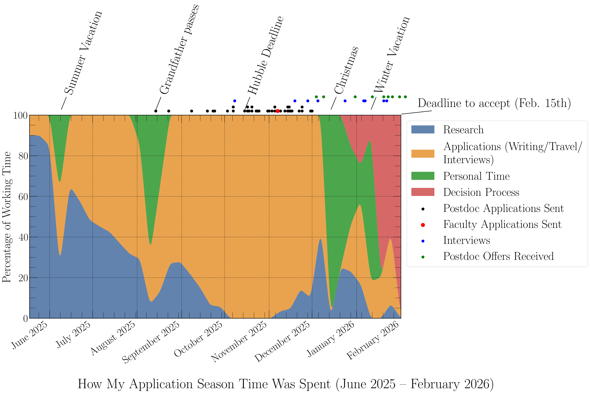
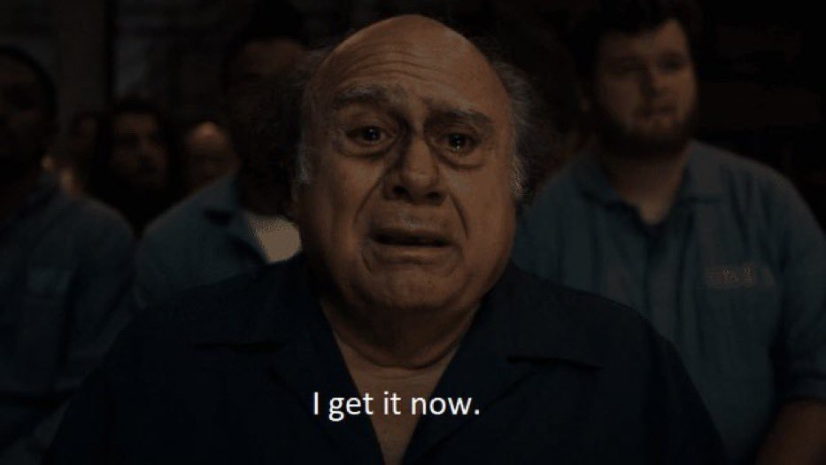
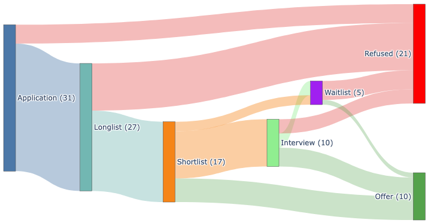
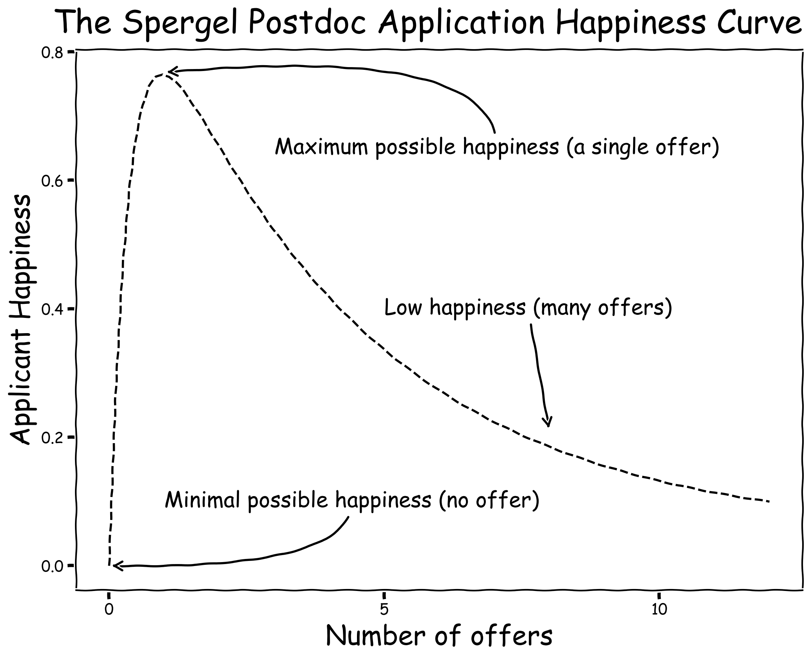

Having just gone through the gruelling experience of applying for postdoctoral positions, I wanted to jot down a few lessons learned and reflections. I will try to focus on what I personally was surprised by and would have liked to know a little ahead of time. I will primarily cover things that I did not really find elsewhere (e.g., "make sure you have good letter writers" is important, but you can find that advice anywhere).

I will also preface this by saying that my experiences are of course mainly applicable to others in astronomy and AI for Science. I was also very fortunate on the market this year, and I want to be upfront about the advantages I had: being at Princeton, having exceptional advisors, and working in a subfield (machine learning for astrophysics) that is currently in high demand. These things matter, and I will try to be honest about where they helped. I also want to encourage anyone with questions to reach out at [ckragh [at] princeton.edu](mailto:ckragh@princeton.edu) (or whichever email I have when you are reading this).

For a more quantitative companion post, where I try to build a forward model/simulation of the market to measure the stochasticity in the application process (among other things), see the [second post in this series](https://astrockragh.github.io/post/). You can see this post as the qualitative part of my reflections, and the second, simulation-based, post as the quantitative part.

## What kind of postdoctoral positions exist?

One thing that was not at all clear to me ahead of time was the different kinds of postdoctoral positions one can apply to. In the end, I constructed four broad categories (that others are free to disagree with), with some potential sub-divisions. I will list these roughly in order of average likelihood of any single application succeeding (from lowest to highest).

**Society of Fellows positions:** A handful of major research universities maintain a "Society of Fellows" --- a small, interdisciplinary group of early-career scholars who are given full freedom and generous resources for a few years, typically alongside regular meals and interactions with distinguished Senior Fellows. These took me completely by surprise. The sheer mafia-like structure --- you can only apply when you are nominated by a sufficiently senior person --- seems shockingly old-fashioned. These positions are also not advertised very clearly (you will only find them if somebody you know makes you aware of them), to the point where several junior faculty members, even at Princeton, did not know that they existed.

That said, if you do get one, you will be very well taken care of. The selection process is extremely thorough, partially because many Senior Fellows and other faculty will be investing significant time in you. I interviewed at two (the Simons Society of Fellows and MIT's Pappalardo Fellowship), and both had day-long visits with many one-on-one meetings, a chalk talk in front of a committee of roughly 15 senior professors, and either a dinner or luncheon with the committee. It is exhausting, but also genuinely enjoyable --- you get to talk to brilliant people across many fields about your work. I also applied to the Harvard Society of Fellows but did not make it to the interview stage. In the end, I did not receive offers from either of the two I interviewed at, which is perfectly normal --- these are extraordinarily competitive.

**Large-scale program positions:** These are fellowships run by national or international organizations, such as the NASA Hubble Fellowship, the Brinson Fellowship, or the Schmidt AI in Science Fellowship. Their defining feature is that they can often be hosted at a range of institutions of your choosing, which gives you remarkable flexibility. They also typically come with their own funding, which in practice means unparalleled freedom --- your money comes from outside the university, so you are not beholden to any particular group or project. This is a huge advantage for developing an independent research program. Fellows also gain access to a broader network of other Fellows in the same program, which can be enormously valuable early in your career.

**Institutional (Prize) Fellowships:** Many institutions now call their normal postdocs "Fellows," which has diluted the title quite a bit. In the upper echelon, we find named Fellowships (e.g., the [Schwarzschild-Fraunhofer at LMU](https://www.univermuenchen.de/index.html) or the [Spitzer at Princeton](https://web.astro.princeton.edu/academic/postdocs)) and "Prize" Fellowships (e.g., the SkAI Prize Postdoctoral Fellowship). Below these sit institutional fellowships, like the [KIPAC Fellowship at Stanford](https://kipac.stanford.edu/) or the [Flatiron Research Fellowship](https://www.simonsfoundation.org/flatiron/). However, I cannot stress enough how much variance there is within these broad statements. Many people have declined a Hubble Fellowship for the most prestigious named fellowship at Harvard (the Clay), and an institutional fellowship at a place that fits your needs can be far better than a prize fellowship elsewhere. It always depends on where you want to be and who you want to work with.

**Personal/project postdocs:** These are positions where you are hired onto a specific PI's grant to work on a defined project. They are by far the most common type of postdoc, and they tend to come with less freedom and lower pay than fellowship positions. There is some stigma attached to them relative to fellowships, mainly because they offer less opportunity to develop a visibly independent research program --- which matters for future faculty hiring. However, project postdocs can actually be the better choice for many people, especially if you do not yet have a fully fleshed-out independent research agenda. Working closely with a more senior researcher gives you direct mentorship and guidance, and sometimes the science you get to do on someone else's well-funded project is simply more exciting than what you could do alone with a fellowship. I only applied to two project postdocs myself, in both cases because I really liked the people running the projects.

Each of these categories comes with its own pros and cons, and with different levels of (highly subjective) prestige. There is no completely general hierarchy between them, but as a rough rule of thumb: the typical prestige of being a Fellow in a Society of Fellows is roughly comparable to holding a large-scale national fellowship, followed by institutional prize fellowships, and then project postdocs. But these are averages --- the variance is enormous, and the best position for you is always the one that best fits your scientific goals and personal life.

## When do you actually do what?

Before I started applying, I assumed that everything would revolve around the Hubble deadline. This turned out to be completely wrong. The application season stretches over many months, with different types of positions having wildly different timelines --- especially if, like me, you are applying to positions that are not purely in astronomy (in my case, physics and AI-first positions had their own schedules).

<center>
 
</center>

The figure above shows how I actually spent my time from June 2025 through February 2026. A few things stand out.

The summer (June--August) is deceptively calm. I spent most of it doing research, with some early thinking about where to apply and drafting initial versions of research statements. This is the time to be strategic: figure out which positions exist, talk to your advisors about who might nominate you for Societies of Fellows, and start sketching out your research proposals. I would strongly recommend having a near-final draft of your research statement by the end of August if you can, because September onwards will be chaos.

Starting in September, applications begin trickling in --- Society of Fellows nominations happen early, and some non-astronomy positions (physics, AI) have earlier deadlines. By October and November, the volume becomes intense. You can see in the figure that applications (writing, travel, interviews) rapidly take over the majority of my working time. The main Hubble/Brinson deadline is typically in mid-November, but there are many other deadlines scattered throughout October, November, and December. This is also when interview travel kicks in.

Life does not stop during application season. You can see on the figure that my grandfather passed away during this period. Personal events, ongoing research commitments, students who need your help --- all of these continue regardless of your deadlines. This is simply a reality of the process, and one reason why the "putting out fires" mentality (described below) is hard to avoid.

Around Christmas, there is a brief lull, but then the decision process begins in January. Interviews, shortlist notifications, and offers start coming in, and suddenly you switch from writing applications to evaluating offers. The deadline to accept most US postdoctoral fellowships is February 15th, which means that January and early February are consumed by a completely different kind of stress: deciding where to go.

## Putting out fires

As a proud northern European, I tend to like a certain amount of order and having things planned out for the near future. I have always been somewhat confused by the way that many professors seem to rarely adopt a similar degree of planning --- despite their impressive positions. I specifically keep in mind a visit to an unnamed university where an unnamed professor was to be the host. A few weeks before the visit, as I was growing increasingly worried about the lack of planning, I started reaching out to the professor-who-shall-not-be-named with increasing frequency, only to be told (paraphrased):

```
"My job is putting out fires. Every day I put out fires. And all I can do is
to put out the biggest and brightest fire. You arriving in a few weeks is
not a fire."
```

At the time I rolled my eyes. How could this tenured faculty member --- running a research group, holding millions of dollars in grant money --- not realize that if they just put out fires before they grew big, there would not be as many big fires!

From the bottom of my heart, I apologize (to many professors) for ever thinking that. I get it now.



There will come a time --- typically around mid-November --- where you are travelling to give talks, sending 5 applications in one week, trying to help a student finish a project, preparing your next presentation, and maybe writing a bit on that paper you just cannot finish. You will forget or push deadlines until the last minute, and everything will be done as a response to feeling the heat from the closest and biggest fire.

The worst part of all this? The applications you send during this time are not really much worse than otherwise. Most of the time I spent fussing over details was not that impactful, and I had a certain level of success even with applications sent after the deadline, or written in a few hours on a train. This is not an excuse to be sloppy --- but it is a reason to not beat yourself up when the process inevitably becomes messy.

## What does a good application look like?

I will not go through the standard "make sure your research statement is well-written" advice --- you can find that in many places. Instead, here are a few things I found to be underappreciated.

**Optimize for skimmability.** Fellowship committees read hundreds of applications. Your application needs to work on two timescales: it should be readable in about one minute (for the initial screening) and reward a careful 20-minute read (for the final round of discussions). In practice, this means having bold key sentences or phrases that convey your main points even to someone who is just flipping through pages. Think of it as writing an abstract for every paragraph. If a committee member can glance at your research statement and immediately understand what you want to do and why it matters, you are ahead of most applicants.

**Respect local formatting cultures.** Different places have surprisingly strong cultural rules around formatting. Things like the length of your cover letter, the size of your margins, and your text alignment can have an unexpectedly strong influence on how your application is perceived. As one example, francophone countries (and Québec in particular) are very particular about **justified text** --- applications without it may be considered unprofessional. Justified text also happens to aid skimmability, so I ended up using it everywhere. More broadly, if you are applying to a place with a specific academic culture, it is worth asking someone from that culture to glance at your materials.

**Be one step ahead of the field, not two.** It is always tempting to propose completely reinventing your field and doing something groundbreaking. But in practice, the most successful proposals tend to be ambitious yet credible --- one clear step beyond the current state of the art, rather than two. If your proposal requires three separate breakthroughs before it can work, reviewers will (reasonably) doubt that it is achievable in a three-year fellowship. Propose the next clear step, and make it compelling. This piece of advice comes from [Eric Gawiser at Rutgers](https://physics.rutgers.edu/people/faculty-list/faculty-profile/gawiser-eric), and it has stuck with me ever since.

**Be excited.** Astronomy (and science in general) is evaluated somewhat subjectively, and fellowship committees are ultimately made up of people who want to fund science that they find exciting. If your application reads like you are bored by your own research, nobody else will be excited either. Genuine enthusiasm is contagious, and it comes through in writing more than you might think. Write about the parts of your research that genuinely thrill you, and let that energy carry the application. This does not mean being hyperbolic --- it means being honest about what you find fascinating.

## Which parts are enjoyable and which are not?

Not everything about the application process is miserable. Some parts are genuinely fun.

The best part, for me, was the creative and intellectual challenge of writing research proposals. You get to sit down and dream about what the most exciting science you could do in the next few years would be. You get to be ambitious, to put forward your most far-reaching vision, and to think carefully about how you would actually pull it off. It is intellectually stimulating in a way that is quite different from day-to-day research, and I found it exciting --- if also a little stressful, because you are putting your best ideas on paper and hoping that others will find them as compelling as you do.

The worst part was the cover letters. They are extraordinarily repetitive. For each application, you write a letter expressing your heartfelt excitement about working with specific people at a specific institution, knowing full well that you are one of 300 applicants and that they will very likely reject you. Doing this 31 times takes an emotional toll, because you have to be enthusiastic every single time, and the enthusiasm has to be genuine --- committees can tell when it is not. By the twentieth cover letter, mustering authentic excitement about a different combination of people and resources becomes a real challenge.

## Feeling very uncertain

<center>
 
</center>

I was very fortunate on the job market this year, but not knowing that *a priori* meant that I spent most of the period from late summer until Christmas feeling incredibly uncertain about whether or not I was doing a good job. I had no idea whether my research proposals were well written, if my CV looked appealing, if my Letters of Recommendation were bad, good, or glowing --- in short, **I had no idea if my applications were good or not**. This situation is quite anxiety-inducing, especially because there is a significant delay between when you start sending out applications and when you get any kind of feedback (interview requests, offers, rejections). This makes learning from the process really hard, because it is missing two cornerstones of efficient learning:

1. **A repeatable environment**, since no two places look for exactly the same things in a potential applicant.
2. **Fast feedback**, because no one can truly remember their thoughts on why exactly they chose to do something more than 3 months ago.

The uncontrolled environment also means that learning from the experiences of others is quite hard --- the market changes, and so will what is considered a "good" and a "bad" application. The only reliable advice I have on managing this uncertainty is to lean heavily on the people around you. I am eternally grateful to my fellow Princeton graduate students, my partner, and my postdoctoral and faculty mentors, who all read my application materials and provided invaluable feedback. This reduced (but did not remove) the feeling of walking blindfolded into an unknown abyss. So if you are applying and need advice (beyond what I have here), please do **feel free to get in touch with me!**

### How many applications should I send?

Because of this large uncertainty, I had no idea how many applications I should send in order to feel reasonably confident of getting a good position. The postdoctoral market is **incredibly inefficient** --- the vast majority of applications will not succeed --- and **incredibly stochastic** (see the section above). In trying to be somewhat certain of landing a position without spending all of your time on applications, these two facts create directly opposing forces: the inefficiency pushes you to apply broadly, but each application takes real time and emotional energy.

I spent a lot of effort early on trying to get a quantitative sense of how stochastic the process actually is, so that I could calibrate the number of applications appropriately. This turned into an entire analysis of its own, which I have written up as a [separate blog post](https://astrockragh.github.io/post/) where I build a forward model of the application process and try to estimate how many applications you need to send as a function of your (unknown) "quality" and the inherent noise in the system.

### What made this year a little special

Beyond the usual stochasticity, the 2025--2026 application season was shaped by significant uncertainty around federal research funding in the United States. The ripple effects were felt at every level of the academic job market:

1. There were close to no senior faculty positions (see e.g., this [interview with my co-advisor, David Spergel](https://issues.org/wp-content/uploads/2025/12/24-27-Spergel-Interview-Winter-2026.pdf)).
2. There were many fewer junior faculty positions than in typical years.
3. Many senior postdocs who would normally have moved into faculty roles ended up staying on as postdocs, taking prestigious fellowships instead --- which compressed the market for everyone below them.
4. Applications from US-based researchers towards Canada and Europe increased substantially, while international applications to the US fell. To put some numbers on this: the University of Toronto's postdoctoral positions saw their application numbers increase by 100 to 200%, and the graduate program here at Princeton received only about 10% of the usual international applications (cutting the total applicant pool by roughly 35%).

All of this made an already stressful process more uncertain. If you went through this cycle, know that it was genuinely harder than usual.

## So how did I actually do in the end?

Before starting, I had no idea about the typical rates of success. I was told everything between 2--25% was typical, which was not very helpful. Instead I ended up taking a more empirical approach and just asked a lot of postdocs about their application statistics, which gave a much better sense of both the mean success rate and (just as importantly) the typical variance. Of course, these estimates are biased high, because I could only ask people who actually got postdocs. What I gathered was that 2--4% is low, 5--20% is normal, and 20--30% is high.

For what it is worth, here is a Sankey plot of my 31 applications:

<center>
 
</center>

Of 31 applications, 27 made it to the longlist, 17 to the shortlist, 10 led to interviews, and I received 10 offers (with 5 ending as waitlists and 21 as rejections at various stages).

I do not want to pretend that my experience was typical --- it was not. I ended up doing much better than I expected, and I want to be honest about why. Part of it was applying to a lot of things, but I also had real advantages: I was at Princeton, I had outstanding advisors, and my subfield (machine learning applied to astrophysics) is currently in high demand. Luck also played a significant role --- the stochasticity of the process means that on a different year, with different committee compositions, things could have gone very differently. I share these numbers not to brag, but as a data point. When I was applying, I desperately wanted to see other people's raw statistics, and I hope this is useful to someone in that same position.

### Combining Fellowships

If you are fortunate enough to receive multiple offers, it is natural to want to combine them to guarantee longer-term stability --- a rare commodity in academic life. However, many institutions are very hesitant to do this for various reasons. From their point of view, you are locking up research funds that they now have to hold in reserve without any guarantee that you will actually show up. You may think that you will definitely take up the second fellowship, but historically this often does not happen. For example, the Carnegie-Princeton Fellowship had a 2-year + 2-year structure, but fewer than half of the Fellows actually moved to the second institution, which is why the fellowship has been discontinued.

I did end up combining fellowships myself, and here are some general rules of thumb that I learned from the process:

1. If you get two positions at the same institution, or in the same city, it is quite likely they will agree to a combination. In general, the stronger the pre-existing links between two institutions, the more likely it is to work.
2. If you cannot make a combination work, as a Fellow with external money (e.g., a Hubble, Brinson, or Schmidt Fellow), you can often negotiate an extra year at the end of the usual fellowship agreement.
3. It is much easier to get a combined position if the second institution is a large, well-funded place with a high level of continuous research funding.
4. A combined position is much more likely to work if you establish some kind of regular visiting arrangement with the second institution during your time at the first, and vice versa once you move.

Do note that this is still somewhat unlikely to work, and it is very possible that you will be told "just apply again in a few years."

### Random things I learned

**Deadlines for thee but not for me.** When a call for applications says something like "***Deadline for all application materials, including Letters of Recommendation, to be submitted is November 1st, 2025***", I took it very seriously. This was an error, and it took me months of anxiety to get over. In reality, the marked deadline is a hard deadline for you, the applicant, only. **Your letter writers can often send in their letters well after most actual deadlines** (with some notable exceptions, like the Hubble and Brinson Fellowships), with the "permitted" lateness scaling roughly with their seniority and prestige. If they are sufficiently senior, they can sometimes just write directly to the director or department chair with their letter. This works for one simple reason: **most application reviews start a few weeks after the deadline, so as long as the letters arrive before the review begins, no harm done**. If your letter writers are late, bug them, but do not immediately despair.

**Being late yourself is bad, but sometimes survivable.** I actually missed a couple of deadlines myself (by not being clear on time zones, or confusing midnight with 5 PM deadlines). How much trouble this caused depended entirely on whether the application was submitted via a web portal (which closes at the stated time) or by email to a person (humans care less about exact deadlines than web servers). Even if you miss a hard, web-based deadline, you should still try to write the people responsible for the search --- it is sometimes still possible to have your application included.

**Formatting culture is real.** As mentioned in the application advice above, all places have surprisingly strong cultural norms around formatting. Things like cover letter length, margin size, and text alignment can have an unexpectedly large influence. Francophone countries in particular are very particular about **justified text**, and will consider most applications without it to be unprofessional. When in doubt, ask someone at the institution what is expected.

### The Spergel Curve of Applicant Happiness

As I was quite anxious about the application season, I wanted to be on the safe side with the number of applications I sent. As the Sankey plot above shows, this worked much better than I expected, resulting in 10 total fellowship offers. This is of course a wonderful problem to have, but it also means that you end up facing a very difficult decision. You will have to disappoint people who believed in you, disappoint yourself (as you will inevitably start dreaming about all the great science you could do at each place), and overall go through an agonizing few weeks. This is why my advisor, David Spergel, has the following theory of applicant happiness:



I am not sure I fully agree --- having two offers is almost certainly better than one. But you do hit a point where the curve starts going down. His point in drawing out this curve was to get me to calm down and apply to fewer things, since my feeling at the time was that at worst I would get many offers, and that this would be a good thing. In retrospect, having many offers does not make you happier. Each offer carries a responsibility to respond quickly so that it can be passed on to the next person, and the weight of the decision itself is real.

## Where I ended up

Making the final decision was, somewhat unexpectedly, one of the hardest parts of the entire process. I spent two full weeks on it essentially full-time --- building spreadsheets ranking offers across 37 (!) different categories, talking to mentors, colleagues, friends, and my partner, and going back and forth far more times than I would like to admit. Every place I got an offer from had something genuinely exciting about it, and I kept dreaming about all the science I could do at each one. Saying no to places that had invested time and belief in me was painful. I am deeply grateful to everyone who gave me advice during this period --- you know who you are.

In the end, I accepted a combination of the **Schmidt AI in Science Fellowship** (through Schmidt Sciences) and a **CITA National Fellowship**, which will take me to the **Canadian Institute for Theoretical Astrophysics (CITA) at the University of Toronto** for two years, followed by two years at **Mila and the Université de Montréal**. I will also be a long-term visitor at **Stockholm University**. These three institutions together span the expertise supporting the different parts of my research, and orient me further towards the Canadian and European scientific communities, which is where I currently see myself being able to make longer-term commitments. Being in the US at Princeton has been enormously good for me, but it is time to try out a different kind of scientific community --- one that works better with my personal life and my long-term plans. And the people I will be working with in Toronto, Montréal, and Stockholm are absolutely amazing scientists. I cannot wait.

If you are going through this process yourself and have questions, or just want to talk to someone who has been through it recently, please do not hesitate to reach out. Good luck --- and remember that the uncertainty you are feeling is completely normal.
