This is the second of two blog post about the post-doctoral job market. The [first one was rather qualitative](https://astrockragh.github.io/post/postdoc_experience1/) whereas this one is very quantitative. It has been inspired by my frustration in not knowing how many applications would be reasonable to send, and not finding useful, quantitative advice to answer that question. Of course one wants to send enough applications to elevate ones chances of getting a position, but sending applications is a huge time investment, so the trade-off has to be considered carefully. I for one ended up spending essentially half a year of full time effort on my applications, [as you can read about in another post](https://astrockragh.github.io/post/postdoc_experience1/), which, given how it turned out, was probably a bit too much.

One of the most common answers I got from my mentors when I asked: "how many applications should I send?", was, "there is no way of knowing, the market is just very stochastic". Of course, being a statistician at heart, I immediately followed up with questions about the order of magnitude of the stochasticity. No one really knew, except that it is **very** stochastic. This made sense to me - after all, I would not know how to pick the best out of N applicants with any certainty. Professors are of course better, but it seems natural that ranking candidates is hard. However, presenting the fact that committee evaluation must be a very noisy process to more senior professors, I was soon given another confusing piece of information. All professors that I spoke to were quite adamant that they are actually very good at ranking applicants, which seemingly contradicts the claim of high stochasticity in postdoc hiring decisions. I was very skeptical of this, since it seemed to me a way of justifying their own success. As explained [in this video](https://www.youtube.com/watch?v=3LopI4YeC4I), successful people tend to overestimate just how much of a role skill plays in these decisions, since nobody who has done well likes to believe that their good fortunes are largely determined by luck.

Of course, there are ways that both can be true at the same time. To see how, let's consider how decisions in any one committee are made (according to the Princeton faculty). A candidate has a vector of skills (e.g., technical skill, creativity, writing, ability to work with others), which gets projected onto a committee-specific vector encoding what that committee values. Two things then contribute to selection noise from the point of view of the applicant:

1. The committee has imperfect knowledge of the skill vector
2. Different committees are searching for different things

The senior people with whom I talked claimed that 2. is the main source of what we applicants perceive as stochasticity. However, for us applicants, it matters less where the noise comes from, we just want to know how noisy the entire process actually is.

### This is the question I have set out to answer.

If you want to skip straight to the actionable advice, jump to [How many applications should I send?](#how-many-applications-should-i-send). If you want to run the simulation I develop and describe below yourself with your own parameters, here is an [interactive Google Colab notebook](https://colab.research.google.com/github/astrockragh/postdoc_market_simulation/blob/main/postdoc_market_colab.ipynb). All the code is hosted on [GitHub](https://github.com/astrockragh/postdoc_market_simulation).

# So how stochastic is the postdoctoral job market?

In order to measure the stochasticity in the job market, we first have to make a forward model of the job market. To quote George Box, all models are wrong, but some are useful. The model I am about to describe is certainly wrong in many of its details, but as we will see, it is useful enough to produce some actionable insights. The hope is that by the end of this post, we will have a table that tells us: *for a given self-assessed ranking, here is how many applications you should send to be N% sure to get at least one position*.

## The model

In a field like astrophysics, roughly 1000 students graduate each year and about 300 postdocs are potentially on the market at any given time. Of course, not all of them end up applying &mdash; maybe 75% of students and a third of postdocs actually enter the applicant pool. The rest of the students immediately leave for industry, as do one third of any given postdoc cohort. The remaining third of the postdocs go on to faculty positions. The simulation takes the full cohort sizes as input and applies these fractions internally, giving an actual market of about 750 students and 100 postdocs competing for 256 positions (see below where this number comes from). 

**Applicant skills.** Each applicant is assigned a scalar "skill" score. Of course, there is no such thing as a single skill dimension, but any committee will eventually collapse applicants down to a 1-dimensional ranking, so I'll do the same. Students are drawn from $\mathcal{N}(0, 1)$ and postdocs (reapplicants) from $\mathcal{N}(1.3, 0.8)$, reflecting the fact that reapplicants have already survived one round of selection, as well some additional training. This is of course a drastic simplification &mdash; real skill is multidimensional &mdash; but it lets us define a global ranking that committees will try to noisily recover.

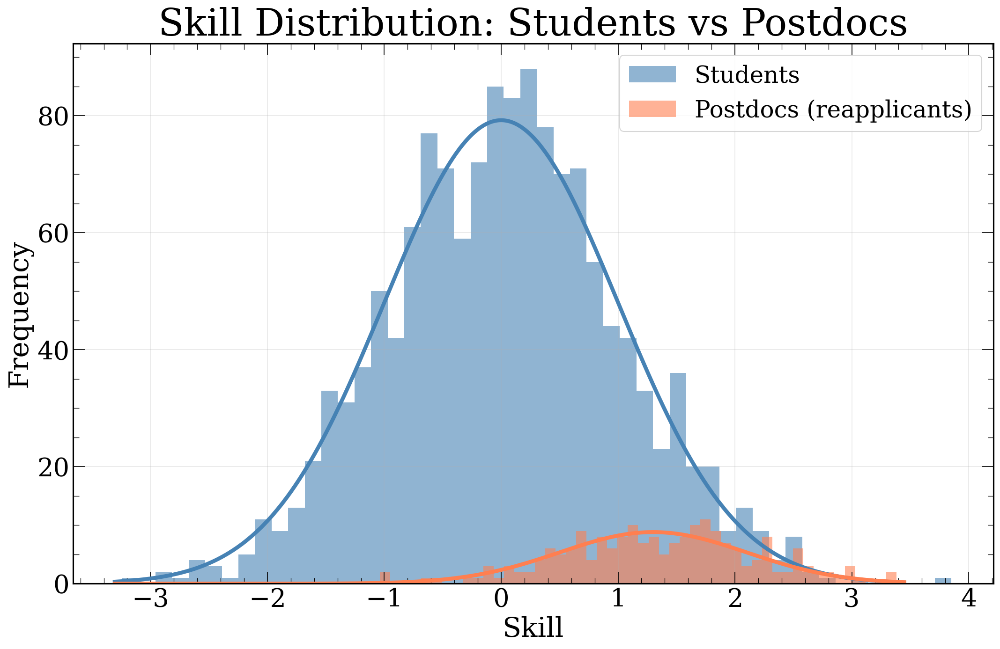

The main thing to notice here is that the high-skill tails of the distributions match. This is by construction and meant to emulate that the best graduating students in a given cohort are roughly as skilled as the best postdocs in a given cohort.

**Position and prestige.** To make a realistic market, we must now set our eyes on the available jobs. The numbers of different postions are based largely on scraping the [AAS job register](https://aas.org/jobregister), scaling by a 50% correction factor (not everything is listed there), and adding in positions such as the Society of Fellows myself, since these aren't advertised openly. The 256 positions are divided into three tiers modelled after real fellowship structures: 6 Society-of-Fellows-type positions (extremely prestigious), 50 prize fellowships, and 200 normal postdoc positions. Each position's prestige score is drawn from a log-normal, with the tier setting the maximum and minimum.

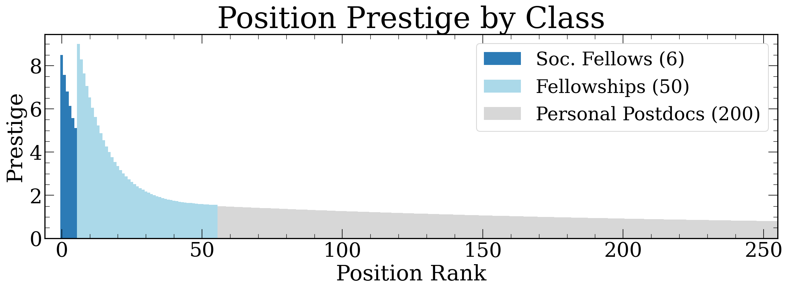

The reason for why these positions need to have an associated "prestige" is that different positions should attract different numbers of applicants when I later on build applicant pools. We will also try tuning how much the best applicants preferentially apply to the best positions, but this will admittedly be a little handwavy. 

This is also a great time to mention something rather important: anything I mention in this post is **only relevant to openly competitive positions**! Many postdocs are hired without ever going through this, so this does not apply to them! 

But for the competitive positions, we must all send some applications. So let's look at this first.

**Applications.** Each student sends applications to a number of positions drawn from a log-normal distribution with mean $\sim 30$ and standard deviation controlled by $\sigma = 0.4$, truncated to reasonable bounds (minimum of 10, maximum of 100). Postdocs send about half as many on average, since they tend to be more targeted. There is also a self-awareness parameter that controls how well applicants target positions appropriate to their skill level. The resulting distribution of applications per position looks like this:

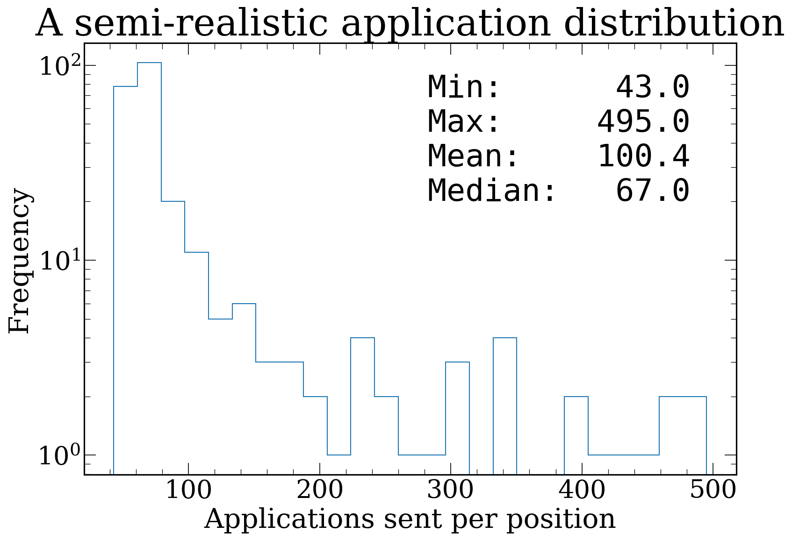

This shows that the median job receives about 67 applications, that most Fellowships get above 150, with the most prestigious positions attracting up to $\sim 500$. This is broadly consistent with the number of applications that something like the Hubble Fellowship will get. 

**Committee rankings and the Mallows model.** This is the key ingredient that we are fitting for! Each committee independently ranks its applicant pool. In a perfectly meritocratic world, every committee would recover the exact global skill ordering. In reality, there is noise. We model this using the [Mallows model](https://en.wikipedia.org/wiki/Mallows_model), a probability distribution over permutations parameterized by a dispersion parameter $\phi \in [0, 1]$. When $\phi = 0$, every committee produces the exact global ranking (zero stochasticity). When $\phi = 1$, the ranking is uniformly random (maximum stochasticity). Values in between give varying degrees of agreement with the skill ordering, and this is exactly the knob we need to tune. 

**The round structure.** The market proceeds in rounds, just like the real job market:

- *Offer phase:* Each open position walks down its stochastically ranked pool and makes an offer to the first applicant still on the market. If the pool is exhausted (everybody already accepted elsewhere), the job triggers a "second call" &mdash; drawing a fresh mini-pool from remaining market participants.
- *Accept phase:* Each applicant who received at least one offer picks the best one and accepts it, leaving the market. The "best one" is defined as the one with the highest prestige, with some noise, to emulate the fact that many people have reasons for choosing less prestigious positions and do not actually know which positions are most "prestigious" (it is, after all, a subjective and made-up concept). All remaining offers are implicitly declined, and the positions that were turned down re-enter the next round.

Rounds continue until all positions are filled or the market is exhausted. In a typical simulation, the market clears in 4-5 rounds. Here is the output from a single run:

```
ROUND 1  |  open=256  market=850
  accepted: 93  (students=65, postdocs=28)
  open jobs: 163

ROUND 2  |  open=163  market=757
  accepted: 80  (students=55, postdocs=25)
  open jobs: 83

ROUND 3  |  open=83  market=677
  accepted: 48  (students=40, postdocs=8)
  open jobs: 35

ROUND 4  |  open=35  market=629
  accepted: 25  (students=23, postdocs=2)
  open jobs: 10

ROUND 5  |  open=10  market=604
  accepted: 10  (students=9, postdocs=1)
  All jobs filled.
```

Notice how the first round is chaotic: 256 jobs fire off offers simultaneously and only about 93 get accepted immediately, because the best applicants receive multiple offers and can only accept one. This cascading process is exactly what makes the market feel so unpredictable from the inside. It also reflects something I have gotten to see first-hand many times.

## Calibrating the stochasticity

Now, we can calibrate this model against the outcomes of actual Princeton cohorts. In the most recent cycle, the graduating astrophysics PhDs (who I assume are randomly drawn from within the top $\sim 20\%$ of applicants globally). I will not put the actual offer distribution here, as the information is somewhat private.

By running the simulation at many different values of $\phi$ and comparing the simulated offer distribution against this observed data, we can fit the stochasticity parameter. Using a profile likelihood analysis, the best fit gives $\phi \approx 0.74$ with notably asymmetric errors: the $1\sigma$ interval is $[0.54, 0.83]$ and the $2\sigma$ interval is $[0.39, 0.90]$. The asymmetry is important &mdash; the data are more constraining toward high stochasticity than toward low stochasticity. The best fit sits comfortably below 1, meaning we can rule out the market being *completely* random at quite high significance. 

What does $\phi \approx 0.74$ mean in practical terms? It roughly corresponds to different committees recovering the global ranking of a student to within about 8 positions on average, out of their full applicant pool! It's worth remembering that two things can drive the stochasticity level up: committees looking for different things, and committees actually having a hard time ranking applicants. This makes the result quite intriguing. Professors must be quite well-aligned in what they are looking for in us applicants, good at finding it in applications, and consistent across many different institutions &mdash; otherwise we would never see markets like in real life where some applicants end up accumulating large amounts of offers. 

However, this then immediately raises another question

## If committees are good at ranking, why does the market seem so random?

So, then, why does everybody say that everything is so stochastic? Well, let's run the job market once with our calibrated $\phi = 0.74$, and plot the rank of the position versus the rank of the applicant who ended up accepting the job.

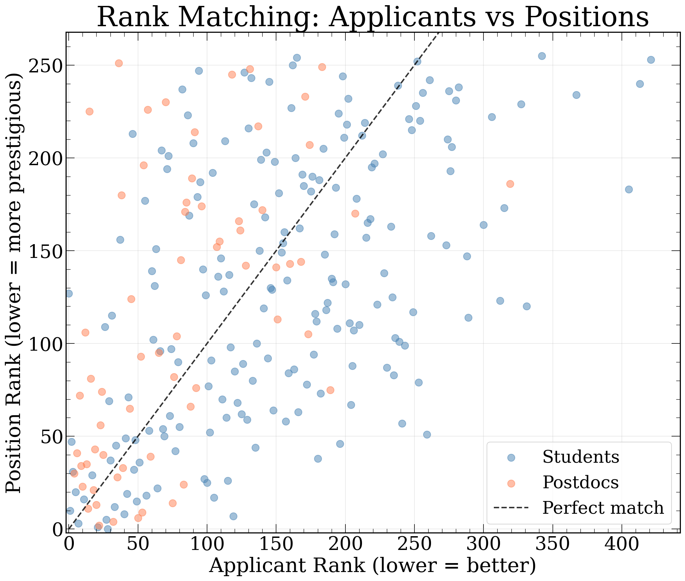

What a mess! So even with individual committees being fairly coherent in their rankings ($\phi = 0.74$), the market outcome still looks enormously stochastic from the point of view of any individual applicant. This is, I think, the key take-away from this exercise:

> **The appearance of high stochasticity can persist even when each individual committee is only minimally stochastic.**

So both of the things that I was told early on, which seemed inconsistent with one another &mdash; that (a) the market should be viewed as very stochastic and that (b) professors are actually quite good at ranking people &mdash; turned out to be true at the same time!

Why does this happen? The core reason is the imbalance: we have $N_\text{applicants} \gg N_\text{positions}$ and $N_\text{applications} \gg N_\text{positions}$. In the classical [Gale-Shapley stable matching problem](https://en.wikipedia.org/wiki/Gale%E2%80%93Shapley_algorithm), where the number of applicants roughly equals the number of positions, the deferred acceptance algorithm can find stable pairings where no unmatched pair would prefer each other. But when you have 850 people competing for 256 spots, with each person applying to ~30 positions, stable matching simply cannot accommodate everyone. The surplus of qualified applicants means that many excellent candidates end up without offers, not because they are unqualified, but because someone equally good happened to rank slightly higher on the handful of committees they both applied to. Small perturbations in committee rankings cascade through the multi-round offer process, producing the wild scatter we see above. Even with no perturbations, the application structure can still lead to considerable noise ().

This also mirrors this great [Veritasium analysis of astronaut selections](https://www.youtube.com/watch?v=3LopI4YeC4I): when 18,300 people apply for 11 spots, even if selection is 95% skill-based, the selected candidates tend to be among the very luckiest, not just the very most skilled. On average, only 1.6 of the 11 selected astronauts would have been the same had the selection been based purely on skill. The postdoc market is less extreme, also because we all get many tries (many positions to apply to), but the same principle applies.

## Coloring by acceptance round

Now let's color each point by the round in which the applicant accepted their offer &mdash; this uncovers a significant source of the apparent scatter.

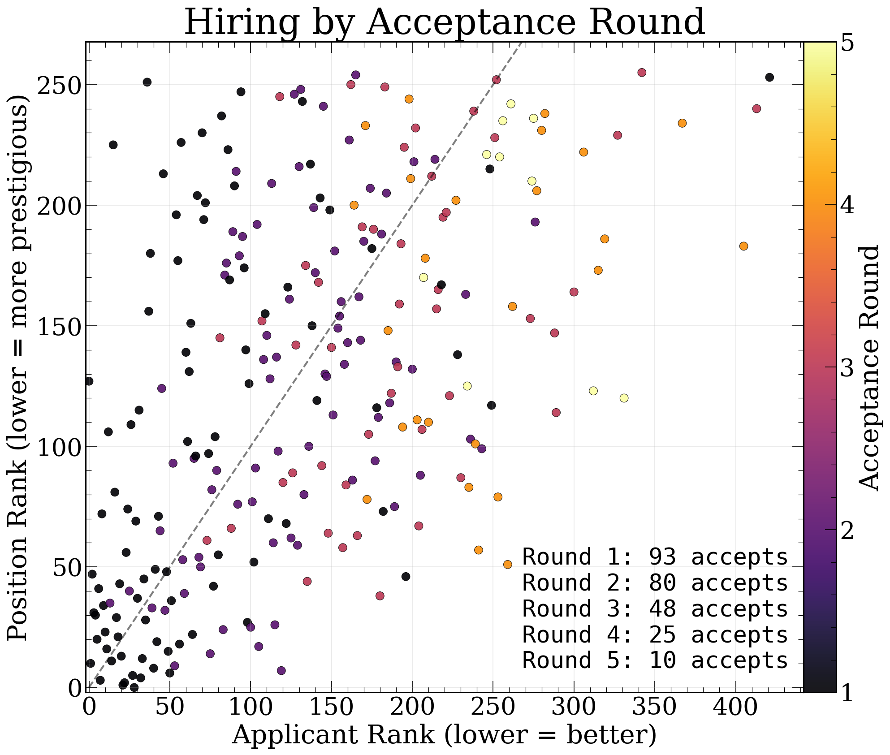

This is revealing. Round 1 acceptances (darkest points) have a lot of scatter on their way --- when a lot of applicants all apply to the same positions, this is inevitable, even with great committees. But rounds 2 and 3 are increase the scatter a lot more: once the top applicants accept and leave the market, positions that were turned down cascade to increasingly off-diagonal matches. Many very good applicants who happened to receive their offers from their second or third choice end up waiting, accumulating additional offers as the market loosens up. I want to note that some candidates end up *having between 5-8 offers purely coming off "waitlists"* every time I run the market simulation!

This highlights something I got to see firsthand (every year) at Princeton: first, that offers tend to cluster quite strongly (the best applicants get many offers simultaneously), and second, that many very good people end up getting put through the painful experience of having to wait months only to then receive several offers in quick succession.

We can see this pattern quantified by looking at how the number of offers distributes across applicant ranks, broken down by acceptance round:

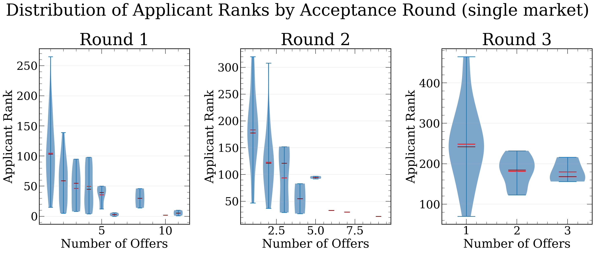

In Round 1, the applicants with the most offers (7-10+) are heavily concentrated at the top ranks, as expected, but the outcomes vary wildly! By Round 2, the people accepting have fewer total offers but still span a wide range of ranks. This makes the inference process that one does after the market runs (`"if I got N offers, what percentile ranked was I?"`) quite hard. We can also visualize the distribution of total offers across rounds:

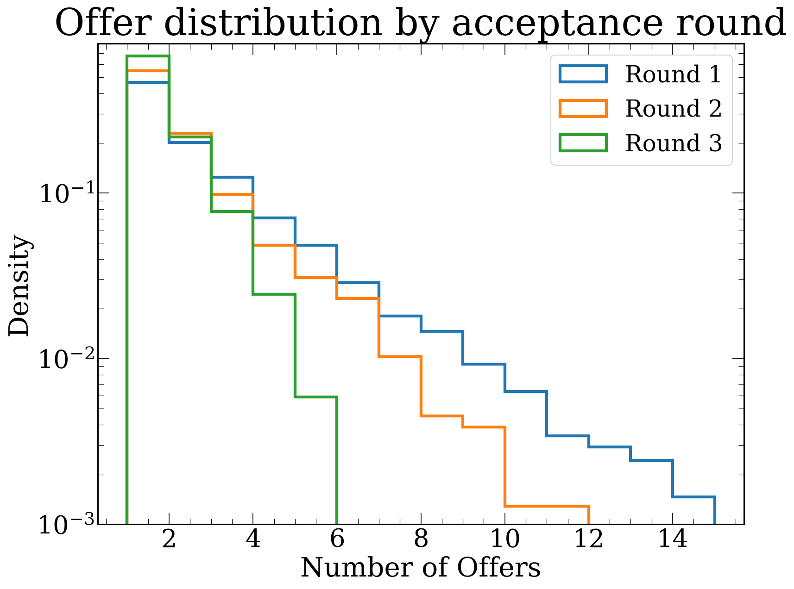

The heavy tail in Round 1 is striking: a few top applicants accumulate more than 10 offers each, which is the root cause of the cascading behavior. Round 2 applicants often have 2-5 offers (which is a lot, and much more than what I expected for a second round), and by Round 3, most people are accepting their only offer.

## The heatmap: building up statistics

A single market run is very noisy, but if we run the market 100 times, we can build up a heatmap of the probability of receiving at least one offer as a function of applicant skill percentile and number of applications sent.

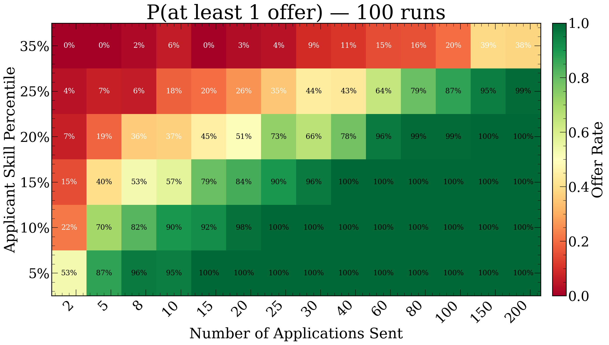

This is very instructive. The top 5% of applicants are essentially guaranteed to get an offer even if they only apply a handful of times &mdash; at 10 applications, they already have a 100% success rate across our 100 simulated markets. However, the picture changes rapidly as you move down the ranking. For a top 15% applicant, the transition from a coin flip to near-certainty happens between roughly 8 and 30 applications. And for someone in the top 25%, even 80 applications only gives you about a 79% chance.

The lesson here is clear: for top applicants, the marginal value of extra applications is low. But for anyone outside the top 10%, the number of applications really starts to matter. There is also a clear diminishing returns effect &mdash; going from 5 to 20 applications has a much bigger impact than going from 100 to 200.

Of course, the really hard question is knowing what your "rank" is... I certainly had no idea going into the market, and even now, post-facto, it is hard to tell! However, there is something encouraging here &mdash; it is clearly worthwhile to spend time heightening your perceived ranking, by doing the things that we all like doing (science!), instead of just, as one advisor put it, "buying more lottery tickets". That is very encouraging! However, if you're going on the market right now, you want the answer to a different question...

# How many applications should I send?

So in truth, the question that I will answer is a little more specified.

### If I believe that I am roughly ranked at a given percentile, how many applications should I send to have an X percent chance of getting at least one offer?

The clean way to answer this is by injecting candidates into the simulated job market. We modify the simulation to insert a test candidate with a pre-determined global rank and a fixed number of applications, and then observe how they fare. Since we are injecting just one extra applicant out of $\sim 850$, the dynamics of the market are negligibly disturbed. We then repeat this hundreds of times to build up statistics. The procedure is: for each combination of skill percentile and number of applications, inject a candidate into 100 independent markets and record how often they receive at least one offer.

Here are the results. This, along with the above heatmap is, I hope, the most directly useful output of this whole exercise.

| Percentile | P=50% | P=75% | P=90% | P=95% | P=99% |
| --- | --- | --- | --- | --- | --- |
| Top 5% | 2 | 5 | 8 | 8 | 15 |
| Top 10% | 5 | 8 | 10 | 20 | 25 |
| Top 15% | 8 | 15 | 25 | 30 | 40 |
| Top 20% | 20 | 40 | 60 | 60 | 80 |
| Top 25% | 60 | 80 | 150 | 150 | 200 |
| Top 35% | >200 | >200 | >200 | >200 | >200 |

**How to read this table:** If you believe you are roughly in the top 15% of applicants globally, you need to send about 8 applications for a 50/50 chance of getting at least one offer, about 15 for a 75% chance, and about 25 for 90% confidence.

I think that the safest use of this table is to try to get one of your advisors or mentors to guess at your ranking. Add 5% for safety, and then use that column to estimate how many applications to send. When you ask your mentors, remember that it is your global ranking, out of the roughly 750 students who actually apply in a given year, that you care about. So top 5% corresponds to roughly the top 38 applicants, top 10% is the top 75, top 20% is the top 150, and so on. This may give you a better way of phrasing the question both to others and to yourself.

If you want to run the simulation with your own parameters, I have made a [Google Colab notebook](https://colab.research.google.com/github/astrockragh/postdoc_market_simulation/blob/main/postdoc_market_colab.ipynb) where you can inject yourself as a candidate and see how you would fare. You should also feel free to change other parameters!

## What if the job market were different?

It is natural to ask how sensitive these results are to the structure of the market. Here we run single-market simulations under four alternative scenarios: halving the number of positions, doubling the number of students, doubling the number of positions, and keeping everything at baseline.

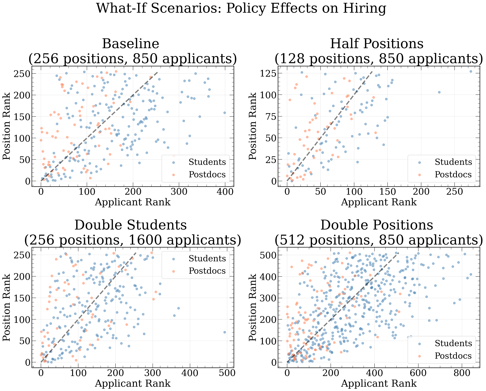

And for a denser view of the same scenarios, accumulated over many markets:

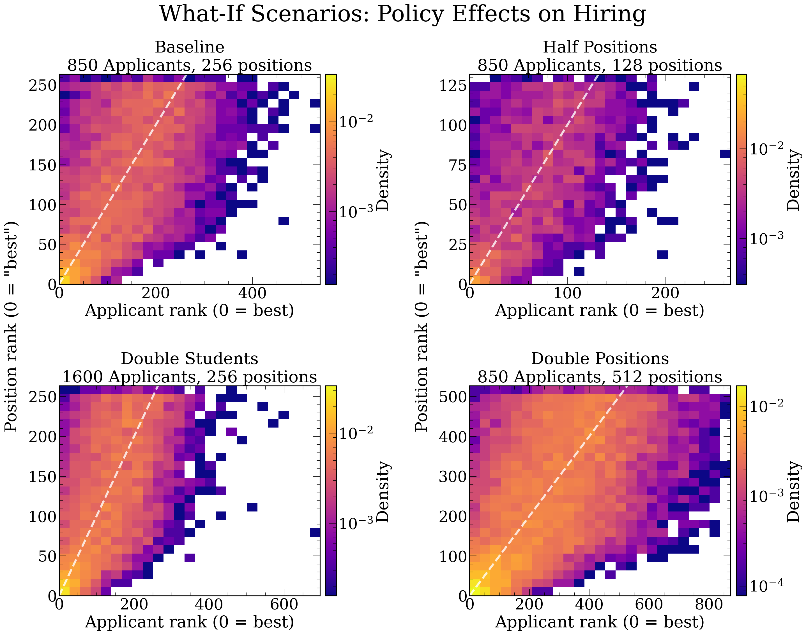

Halving positions or doubling students makes the market more chaotic, but not as much as I thought &mdash; the scatter plots become slightly more dispersed, and many more qualified applicants are left without offers, but the noise structure is similar. I was surprised that this didn't change more, but I guess that the takeaway is that the market structure sets the noise, even if you change the basic parameters of any one market. 

## The effect of stochasticity itself

Finally, we can directly visualize what happens when we vary the stochasticity parameter $\phi$. Here we show three scenarios side by side: near-perfect committee selection ($\phi = 0.05$), our calibrated value ($\phi = 0.74$), and high randomness ($\phi = 0.95$).

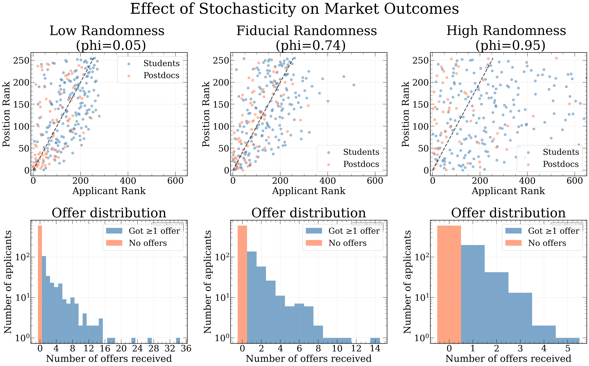

At $\phi = 0.05$ (near-perfect/consistent selection), the scatter plot shows a relatively tight band around the diagonal. Committees agree almost perfectly, so the best people get the best jobs. But even here, there is visible scatter &mdash; the many applications and the multi-round cascading process still introduces some randomness, even when individual committees are essentially perfect. The offer distribution has a very heavy tail: the very best applicants hoover up enormous numbers of offers (up to 35!), leaving everyone else with very few. 35 offers has essentially never happened - the most I have heard of myself is 17.

At our calibrated value of $\phi = 0.74$, we see the familiar moderate scatter. The offer distribution is a bit more equitable &mdash; the maximum is around 14 offers &mdash; consistent with the maximum number of offers we hear about as outliers from time to time.

At $\phi = 0.95$ (high randomness), the scatter plot is essentially a uniform cloud. Interestingly, the offer distribution actually becomes more compressed: when committees are ranking nearly at random, no one is consistently ranked highly across many committees, so the maximum number of offers anyone receives is only about 5. This is, in a weird way, the most "fair" outcome in terms of offer distribution &mdash; but it is also the most disconnected from actual skill.

# Final take-aways

I think that the biggest take-away from this exercise is that the main determinant of success on the postdoc market really is global ranking, much more than number of applications sent. This is uplifting &mdash; as an applicant, you really do benefit mostly from doing more scientific work (I am counting outreach and other related things as scientific work, yes), instead of spending all too much time sending more applications. It also goes directly contrary to a piece of advice I got quite a lot: "applications are a lottery, and you just have to make sure that you buy enough lottery tickets". The data and model say otherwise: for the best applicants, even a modest number of applications is sufficient, while for applicants further down the ranking, no realistic number of applications can overcome the fundamental constraint that there are roughly five times more applicants than positions.

It is also very important to keep in mind that the global ranking system is a toy model. Real rankings are driven by a lot of biases that affect the perception of a candidate's "true" skill &mdash; the prestige of your PhD institution, the fame of your advisor, whether your subfield is trendy, and many other factors. What this exercise shows, in part, is that whatever biases exist in any one committee must also exist in most other committees. The consistency across committees is precisely what gives the market its apparent meritocratic character, but it also means that systemic biases cannot be escaped by simply sending more applications.

Finally, I hope the table above and the [accompanying interactive notebook](https://colab.research.google.com/github/astrockragh/postdoc_market_simulation/blob/main/postdoc_market_colab.ipynb) can be of some practical use to future applicants trying to navigate this process. If you want everything I have produced, it is on [GitHub](https://github.com/astrockragh/postdoc_market_simulation), as always!

This blog post will keep on getting updated as I go - but for the time being I have probably already spent way too much time (~2 weeks) of work on it.
