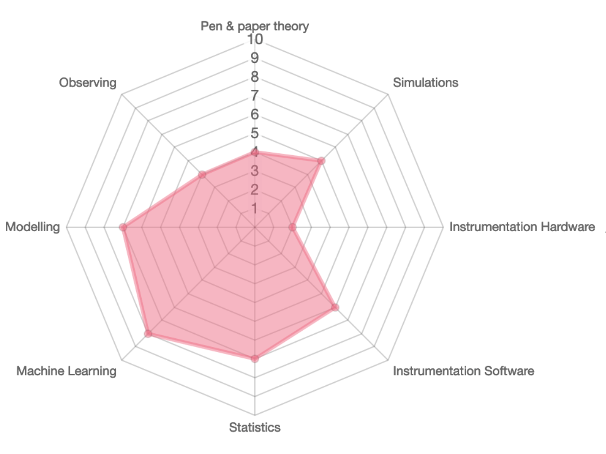

A question that many astronomers often ask is whether a given person is an _observer_ or a _theorist_. This bimodal view of our discipline is quite outdated, but nonetheless persistent. Below I give a short overview of some of the considerations people make when evaluating my position in the field, considerations that I make when answering the question, and how I see my own role.

### Why some consider me a theorist

My first series of papers in graduate school (on [galaxy formation histories](/project/mangrove) and [environments](/project/gnn_environment)) were all done starting from simulation data, which shaped the early talks I gave to scientific audiences, and therefore this view of me as a theorist. 

Furthermore, most of the people in the field of AstroxML (machine learning applied to astronomy) tend to mainly use simulated data products to tune their models, which land them in the "theory"-bin, and so do I, by association.

This view is mainly wrong because, well, I really do not like using simulated data as a first approach. Philosophically, I am an **empiricist**, meaning that I am only really interested in things that can be **measured** in the real world, and I spend a lot of time taking, improving, and using real data from real instruments.

But... then, I must be an observer?

<!-- Simulations, statistics, data analysis, machine learning -->

### Why some consider me an observer

The majority of my time at Princeton and at the University of Copenhagen has been focused on observations. My first paper was on _empirically_ [classifying gamma-ray bursts](/project/tsne_grb), then I worked on measuring and forecasting [cosmic variance for JWST](/project/high_z_jwst), writing proposals for JWST, calibrating point-spread functions for [COSMOS2020](/project/cosmos), then on observing [neutrinos with IceCube](/project/neutrino_ml). This work has continued while at Princeton, where I have been CoI on a couple of succesful JWST proposals, and thought some more about [cosmic variance](/project/most_massive_jwst). 

However, my biggest claim to being an observer has come from the times I have actually physically been observing (which I where the picture at the top of the post is from), as well as my +3 year-involvement in the engineering/commissioning teams for the Prime Focus Spectrograph (PFS) and its auxilliary telescope, the [Subaru Night Sky Spectrograph (SuNSS)](/project/sunss_airglow).

But... if I am on the engineering team, does that not mean that I do instrumentation then?

<!-- SuNSS, PFS, observing on Hawaii, COSMOS, Beasts, Massive Quiescent galaxies with Francesco, proposals -->

### Why some consider me an instrumentalist

This is perhaps the easiest view to neglect, but it has happened that people think I only do instrumentation. This comes from the fact that I spend a good part of my time worrying about software (wavelength/flux calibration) and hardware (fiber connectors) for massively multiplexed spectrographs like PFS. However, as of now, most of what I do for these instruments is to study the [airglow](/project/sunss_airglow), the intrinsic emission of the night sky, and using what we find to improve the performance.
Therefore, I do not really qualify as a real instrumentalist. 

So if I do not fit into these bins, do I even really count as an astrophysicist?

<!-- Software for PFS/SuNSS -->

### Why some do not consider me an astrophysicist at all

A view I have encountered from a few (mainly older) people, is that what I do has nothing to do with "real astrophysics". This view mainly comes from people who hear that I care about statistics and machine learning, and therefore classify me as a kind of lost computer scientist.

Of course, my interest in statistics and machine learning really comes from their applicability for real, physical problems, so I am definitely not just a computer scientist who got lost. 

But what am I then?

### My profile as I see it

My academic profile is a bit weird, mostly because it is very multi-faceted. This makes some people a bit uncomfortable, because they cannot quite nail me down, but I really like having an eclectic profile! The possibility for being broad is one of the main reasons I fell in love with astrophysics to begin with! 

I also think of astrophysics as being a fundamentally composite science, in need of broad skill-sets, and when I look at the true greats of the field, I see people who skillfully spanned everything from theory to hardware-building.[^1]

Of course, I do not span everything, and for the things I do, not to the same extent, so I have tried to summarise how I see my skill-set as of October 3rd, 2024. The results can be seen in the below radar graph.

This will surely change over the years. However, I will always love measuring things. Astrophysics is only a science because we measure real things with real instruments. It is in real data that the true wonders of the universe lie.

[^1]: Think of people like Jim Gunn, who made fundamental contributions to everything he touched!