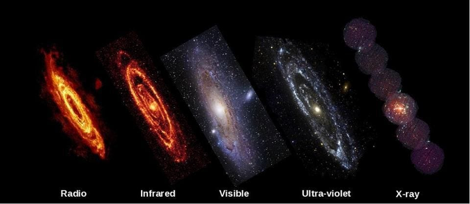
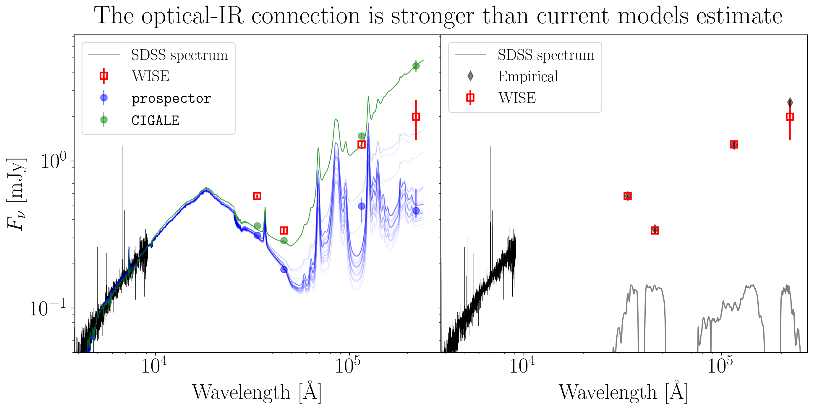
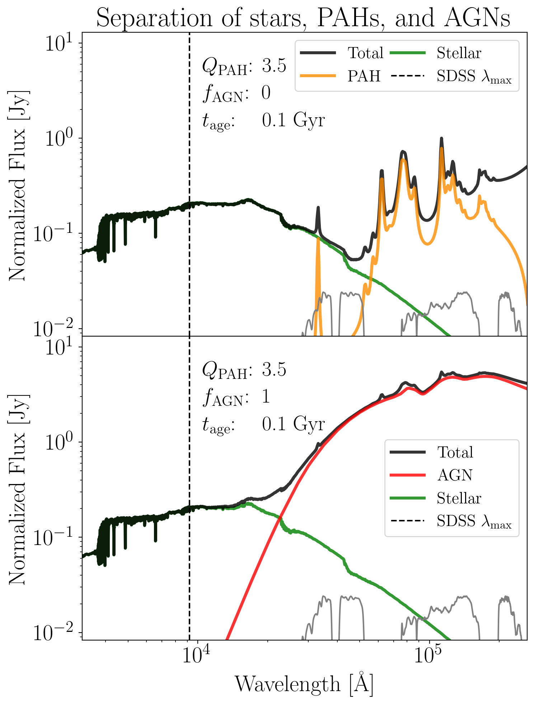
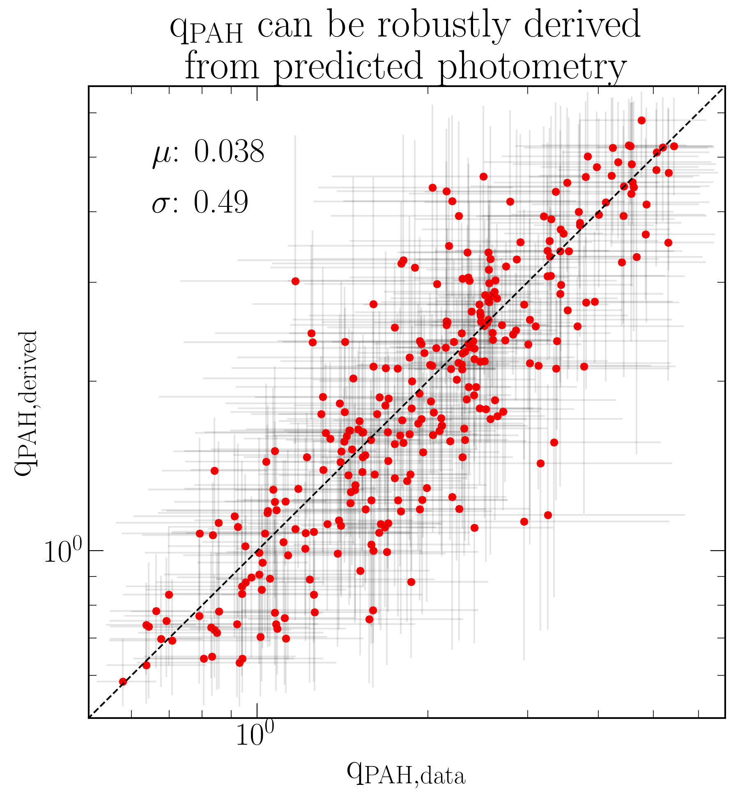
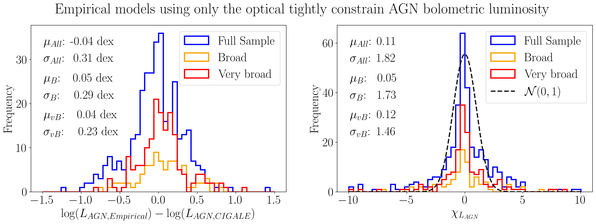

<!-- 
List of points to make:

- Start with the current paradigm, and pretty pictures

- Show the crazy predictions of the SED fitting codes - highlight that they are also overconfident. Model misspecification.

- Show our predictions, and discuss why we are doing so much better. Discuss the stability coming from the auto-encoding step. Include notebook here

- Discuss the fundamental galaxy hyper-plane (with pictures of fundamental plane/SFMS).

- Discuss how this means that a well-made model could do amazingly well!

-------- -->

<!-- # **Galaxy formation unveiled through the connection between the optical and infrared** -->

Galaxies are amazing objects! One of the most exciting aspects of galaxy formation is just how many different physical processes work together to make these breathtaking displays of beauty.
These different components also emit light in different wavelength ranges, meaning that any one galaxy will look very different depending on the kind of light we choose to look at it with. Just look at the galaxy below!



This makes galaxies even more interesting, but unfortunately for the people who model them, it also makes them **even more complicated**. 
That is why studying each wavelength ranges (and the different components which dominate them) has traditionally been considered **separate subfields** of studying galaxies. 

**Each wavelength range is complex enough to be its own subfield!**

One can thus only imagine the complexity facing those who spend their lives modelling the **multi-wavelength** emission of galaxies!
It is their (un)happy task to stitch together all the knowledge from these separate subfields. However, the historical separation of the subfields makes its way into their models, which causes **all kinds of problems**!

Because of this separation, many of the components of these models are modelled as completely independent. However, **that is not how real galaxies work**. In reality, the different components of galaxies are all **coupled** to each other.

The reason for why these couplings are not in our best models is because it is not clear just how coupled these components actually are?\
Just a little? A lot?\
Who knows?

Well, keep reading, because now **we** know!

## How coupled are galaxy components?

How can we tell how strongly coupled different galaxy components are? We can exploit the very fact that different galaxy components emit at different wavelengths, and then investigate the **correlations between emission those wavelengths**.
Others have already tried this before, but they were lacking the tools that we used, and therefore ended up simply confirming the old separability paradigm.

<!-- Our latest research SHATTERS this paradigm, unveiling a revolutionary way to predict infrared (IR) emission from optical spectra with jaw-dropping accuracy! 😲✨

SED-fitting models have long struggled to make sense of IR emission using only optical data, often producing absurdly overconfident predictions.
 Our study exposes the truth: these models aren't capturing the real physics at play. Instead, they rely on flawed assumptions that lead to massive errors 
 [Boquien et al., 2019][1]; [Leja et al., 2017][2]. 🔍💡 -->

### A Bold New Approach That Changes Everything 🔥
We decided to do things differently. We built a **data-driven mmodel** that delivers astonishing results, by connecting optical spectra from the [Sloan Digital Sky Survey (SDSS)](https://www.sdss.org/) to IR photometry from the [WISE satellite](https://wise2.ipac.caltech.edu/).
We train our model to predict the WISE photometry from the optical SDSS spectra, and achieve an unprecedented **χ² ≈ 1** (this means perfect predictions) across all WISE photometric bands—leaving, which leaves all of the traditional methods **in the dust**! 🚗💨 
The χ² results are great, but that is not all. We spent 6 months throwing every possibly test at the model, trying to poke holes in our results, but it just kept on working flawlessly.

The conclusion is simple; the parts of the galaxy which dominate the optical are **extremely tightly coupled** to those which dominate the IR.

So what’s the secret sauce? Before training a small neural network to do the predictions, we introduce an **auto-encoding step**, which stabilizes predictions and ensures an efficient, low-dimensional representation of galaxy spectra.[^3]
This is what allows our model to make ultra-precise predictions that were previously thought impossible!

🚀 Want to see the magic in action? We’ve made our code and dataset **publicly available** on GitHub: [IR_optical_demo](https://github.com/astrockragh/IR_optical_demo). **Check it out, experiment, and prepare to be surprised!**

### Shattering the old paradigm

To contrast our results with the existing state of the art, we compare our results with those from two spectrum (SED) fitting codes, ```CIGALE``` and ```prospector```.[^1]
These models comprise 30 years of development, so they really are the best that astrophysics has to offer!

The task here is the same. Fit the optical and predict what is going on in the infrared. Below you can see how these SED models do (left) versus our data-driven model (right).



It is obvious that the predictions of the SED models are absolute junk, while the empirical model is basically perfect.\
You might be a little confused about all the blue lines. These come from what we call the *posterior* of the model. The posterior encodes the distribution of possible outcomes given the optical data. 

From looking at the samples from the posterior, we see that the SED models are not only incorrect in their central estimates, they are **overconfidently incorrect**. None of the samples are even close to the data.

This reflects the worst possible posterior that we encounter in statistics - something my esteemed colleague [Yashar Hezaveh](https://www.astro.umontreal.ca/~hezaveh/hezaveh/Home.html) affectionaly calls an **asshole posterior**.

The **asshole posterior** is a result of what we call **model misspecification**. Model misspecification is exactly what it sounds like - using a model of some data which does not actually correspond to the mechanism which generated that data. Here, a big part of the model misspecification is **allowing each component to vary independently**. This assumption is understandable from the point of view that it makes modelling much easier, it just has the *minor* drawback that **it's wrong**.

### Constraining the individual components

So what are the components that we keep on talking about? Well, most of the emission that WISE sees comes a special kind of dust that we call Polycyclic Aromatic Hydrocarbons (PAHs) and from Active Galactic Nuclei (AGN), black holes at the center of galaxies which superheat their surroundings as they swallow everything! On the other hand, SDSS mostly sees the light from stars and gas heated by stars. The below figure how these components dominate completely different areas of the spectrum.



Our hypothesis is that we can constrain them starting from the optical, **even though we don't directly see them**. This is implied by the fact that we predict the photometry, but let's show it directly! When we try going directly to the PAH fraction ($q_{PAH}$) we can constrain it to a breathtaking precision of 7%, **without ever seeing their emission**. Again, this is because the components are **coupled**.



We can do a similar task for the AGNs. Here we need to do a little pre-selections to make sure that we know that a given object is an AGN. The way to do so is by selecting objects which also emit strongly in X-rays. For this X-ray selected sample, we can then learn to predict the *bolometric luminosity* (bolometric means integrated over all wavelengths). The golden target is an accuracy of 0.3 dex (dex is astronomy for unit in logarithmic base 10, so 0.3 dex is about a factor of 2). The results are shown below. 



We don't quite make it, but we're very close! Some of these objects have broad lines (class B) or very broad lines (class vB), meaning that we can directly see some emission from the black hole. For these, we can easily predict the luminosities!

This represents a massive leap forward in understanding galaxy evolution and the interplay between stars, dust, and active galactic nuclei (AGN).

### The Universe's Hidden Blueprint: A Fundamental Galaxy Hyper-Plane 🌌📈
These discoveries aren't just exciting—it’s **groundbreaking**. They suggest that galaxies don’t sprawl across an infinite parameter space as previously assumed. Instead, galaxies must adhere to a precise, **well-defined fundamental hyper-plane**, echoing well-known astrophysical relations like the **fundamental plane of elliptical galaxies**[^5] and the **Star-Forming Main Sequence (SFMS)**[^6], where galaxies globally exhibit tight relations.

What does this mean? It means we’re closer than ever to cracking the **code of galaxy evolution!** By accurately predicting IR properties from optical spectra, we’ve proven that key galaxy traits are **deeply interconnected** across wavelengths. This insight **paves the way** for an era of **unprecedented precision** in astrophysical modeling.
This means that the future is bright for making new models.

With **JWST** and future spectroscopic surveys like **PFS** and **DESI** offering even richer datasets, the time has come to **improve our outdated models** and **embrace cutting-edge, data-driven techniques**. 

### The secret to galaxy evolution was hidden in plain sight 🔭✨

All of the data that we used has been public for more than a decade, but yet, nobody had uncovered this important truth. The universe has been hiding its secrets in plain sight, and we’re finally uncovering them. By rethinking how we model galaxies, we are not just improving predictions — **we’re reshaping our understanding of galaxies.** The future of galaxy evolution studies has never been more **exciting**, and I can't wait to continue working on it!  

### Stay tuned, this is only the beginning! 🎉🌠
---

I cannot overstate the importance of my advisors and collaborators for the success of this project. Especially [Peter Melchior](https://pmelchior.net/), [David Spergel](https://en.wikipedia.org/wiki/David_Spergel), and [Andy Goulding](https://www.astro.princeton.edu/~goulding/) made fundamental contributions.

### References
[^1]: See more details about ```CIGALE``` in [Boquien et al., 2019](https://cigale.lam.fr) and ```prospector``` in [Leja et al., 2017](https://prospectorexplorer.github.io).
[^3]: See [Melchior et al., 2023](https://ui.adsabs.harvard.edu/abs/2023AJ....166...74M/abstract) and [Liang et al., 2023](https://ui.adsabs.harvard.edu/abs/2023AJ....166...75L/abstract).
[^5]: [Djorgovski & Davis, 1987](https://arxiv.org/abs/astro-ph/9603025)
[^6]: [Speagle et al., 2014](https://arxiv.org/abs/1405.2041)

