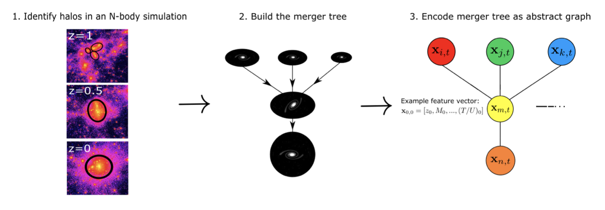
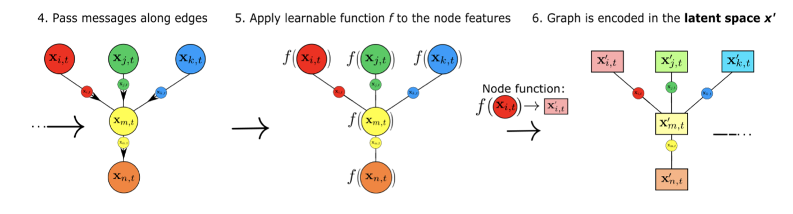

First of all, I've written two versions of this post, this one is a little harder to understand (more jargon) but more concise! The other version can be found under "Blog posts".

Efficiently mapping baryonic properties onto dark matter is a major challenge in astrophysics.
Although semi-analytic models (SAMs)[^sam] and hydrodynamical simulations have made impressive advances in reproducing galaxy observables across cosmologically significant volumes, these methods still require significant computation times, representing a barrier to many applications.

Some advances have been made thanks to Machine Learning models, which learn mappings between the much less expensive dark matter only simulations and baryonic galaxy properties. However, these ML emulators still lack a lot of precision, and provide only few insights into the processes that they emulate! This is mainly because they try to map directly between dark matter halos and galaxies, ignoring formation and environmental effects.

In this project, we improved on both the precision and interpretability of previous work in the field, by including the formation history and showing that when it comes to nature versus nurture for galaxies, **nurture matters a lot**!

We do so by introducing **Mangrove**, a Graph Neural Network which works on **merger trees**, which encode the formation history of the dark matter halo.

Mangrove is twice as precise as other ML models, and allows us to put galaxies into dark matter simulations between 104 and 109 times faster than a SAM and IllustrisTNG codes, respectively.

## Technical stuff

First of all, we don't completely bypass the simulation step, since we still need to run a simulation, but only one with _nothing but dark matter_. Because dark matter is so simple, this can be done pretty quickly. Then, once we have that simulation, we can try to "paint" galaxies on top of the dark matter. This is by no means the first time this has been attempted, but earlier papers have only included features from the final time halo of the simulation as input to their models (a list of relevant references can be found in our paper). 

Mangrove improves on these works by using not just the final halo, but an encoding of the temporal evolution of the dark matter in the shape of a **merger tree**. 

The merger tree is made by simply stopping the simulation at different times/redshifts and identifying the halos where we know that galaxies live. We then see which halos merge with other halos from timestep to timestep, and build a tree-like structure encoding this evolution (see Fig. 1).

<!--  -->

<figure>

<figcaption align = "center"><b>Fig.1 - Running a simulation and identifying halos at different time steps allows us to build the merger tree, which can then easily be encoded as a graph. </b></figcaption>
</figure>

We can then encode the merger tree as a mathematical **graph**, which in this context simply means a collection of nodes and edges, where each node represents a halo, and the edges determine how they have interacted with each other over time. When we have the graphs we can use a [Graph Neural Network (GNN)](https://en.wikipedia.org/wiki/Graph_neural_network), to learn how the galaxies pertaining to those merger trees should be.

In order to build an emulator, we also have to find something to emulate. In this post I discuss results from emulating the outputs from a Semi-Analytic Model[^sam] but it works just as well for other kinds of simulations, like magneto-hydrodynamical simulations like [IllustrisTNG](https://www.tng-project.org/)!

Mangrove is a Graph Neural Network (GNN). GNNs work by acting on both nodes, and the **neighbourhood** of that node, meaning all the nodes that is connected to it by an edge. 
The way we learn from both nodes and neighbourhoods is through *Message Passing*. Message passing means that each node sends information about its current state along the edges of the graph, and is then updated by a learnable[^learnable] function *f*. This information passed along the edges is then used to update the state of the node through another learnable[^learnable] function *g*.

<figure>

</figure>

<figure>

<figcaption align = "center"><b>Fig.2 - Messages are passed along edges, and the nodes are updated. The updated nodes are then summed over and decoded to give us the properties of the galaxy that resulted from that merger tree. </b></figcaption>
</figure>

After doing a couple of these message passing steps, we then sum over all halos in the merger tree and use **yet another learnable function** *h*, that decodes this sum and predicts the aspects of galaxies that we are interested in, such as the total mass of the stars in the galaxy, the mass of the black hole at the center and the amount of cold gas, as well as the uncertainties on these quantities.

## Results

How much better does Mangrove do compared to methods you ask? 

Well, let's compare how well assign stellar masses to halos work with different methods!

The first comparison is with the traditional method for assigning galaxy properties based on their dark matter halos, Abundance Matching. Abundance Matching is quite simple, assuming only that there exists a monotonic relationship between halo and galaxy properties. That means that if we were to assign stellar masses to the halos, the most massive halo would get the highest stellar mass, the least massive the least stellar mass and so on. If we compare the abundance matched relationship to the one we predict, we see a dramatic difference. Note that all values are given in logarithmic units.

<figure>

<figcaption align = "center"><b>Fig.3 - We show the relationship between what we are supposed to be getting on the x-axis and what we actually predict using either method on the y-axis. A perfect prediction would mean that all point were on the diagonal, therefore the goal is to cluster as tightly around the diagonal as possible. The difference is quite apparent. </b></figcaption>
</figure>

But, that is perhaps an unfair comparison. We use ML after all, and abundance matching uses nothing but a single number per halo.

We should then maybe compare to other ML methods that use a lot of information _but_ only from the final halo. That seems more fair.

But as is apparent, Mangrove still outperforms this by about a factor of 2 when measured by how much the two methods deviate from perfect predictions.

<figure>

<figcaption align = "center"><b>Fig.4 - Same as Fig. 3, but comparing to the state of the art machine learning techniques. The difference is still striking. </b></figcaption>
</figure>

Mangrove can also predict a lot of other things, like the amount of cold gas in a galaxy (Mcold), how fast it is making stars right now (Star Formation Rate/SFR), how much metal there is in the gas (Zgas) and the mass of the black hole at its center (MBH). 

Mangrove does better than all of the above mentioned methods across the board, which again, is a simple statement that **formation history matters**!

<figure>

<figcaption align = "center"><b>Fig.5 - Same as Fig. 4/5, but here we show how other galaxy properties, all improvements over the current state of the art. </b></figcaption>
</figure>

### Other fun things

Now that we have a well-working model, we can then try to figure out where the improvement comes from. Is it in the first few timesteps, the initial conditions? Can we make galaxies at different spots in time?

The answer to the last question turns out to be yes. If we take a single Mangrove model and train it at several redshifts, we see that it both does well at the new times, but also when interpolating! It is also noteworthy that the model does not become worse when doing the more complicated task of learning a more general mapping that applies at a wider range of redshifts.

<figure>

<figcaption align = "center"><b>Fig.6 - Mangrove can do galaxies across time, and interpolate to redshifts it has never seen before! </b></figcaption>
</figure>

In terms of removing things from the model, we tried to simply cut down the merger tree from above, leaving out the very earliest halos. We found that the closer you get to the present day, the more each halo matters. The effect is so strong that removing the first half of the merger tree doesn't matter much, but removing the final 1% is measurable!

<figure>

<figcaption align = "center"><b>Fig.7 - By removing parts of the merger tree, we see that most of the information comes from times closer to the present day. </b></figcaption>
</figure>

# Conclusion

If there is one thing that one should remember from this paper, it is that the long-standing 'nature versus nurture' debate is not just for humans. It also matters for galaxies, and with our code, Mangrove, we can take both aspects into account, and make big improvements!

**It matters *how* we build our galaxies!**

## Code

Anyone who wishes to do anything similar to this project is encouraged [read the paper](https://ui.adsabs.harvard.edu/search/p_=0&q=author%3A%22Jespersen%2C%20Christian%20K.%22&sort=date%20desc%2C%20bibcode%20desc) and check out the [Github](https://github.com/astrockragh/Mangrove). All the code used for the projects is free to use, although I do not guarantee that it will be easy to find your way around in it!

[^sam]: Semi Analytic Models are a kind of simulation that is run after running a simulation of only the dark matter in the universe. A good early reference is https://arxiv.org/pdf/astro-ph/9802268.pdf 

[^learnable]: Any time I mention a "learnable function", think about it as a very basic neural network, what we call a Multi-Layer Perceptron (MLP). An illustration of an MLP can be found at https://en.wikipedia.org/wiki/Neural_network#/media/File:Neural_network_example.svg