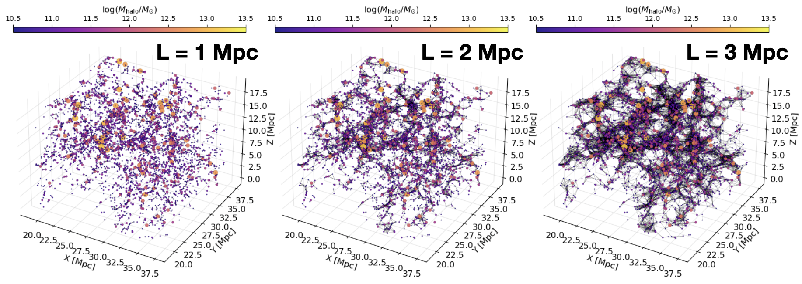
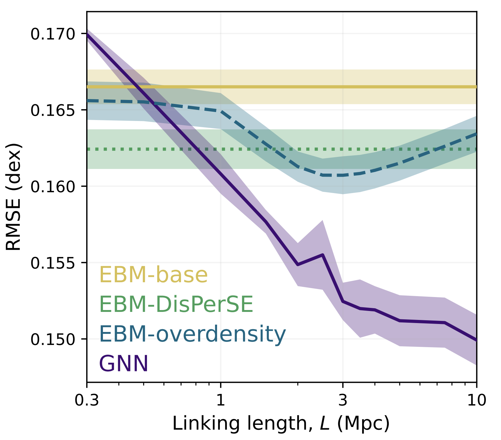
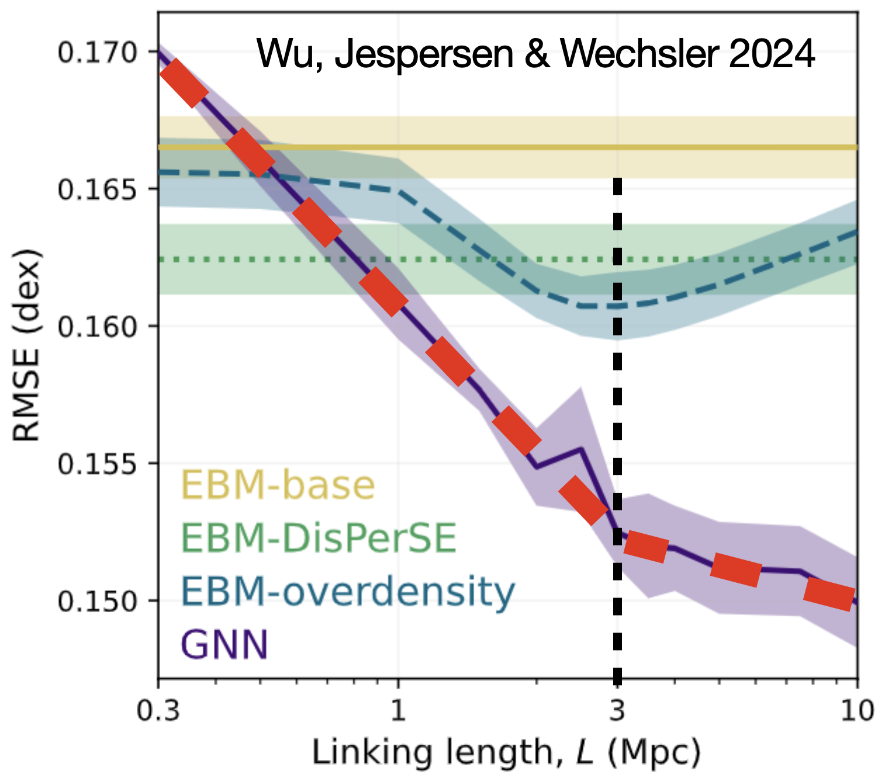
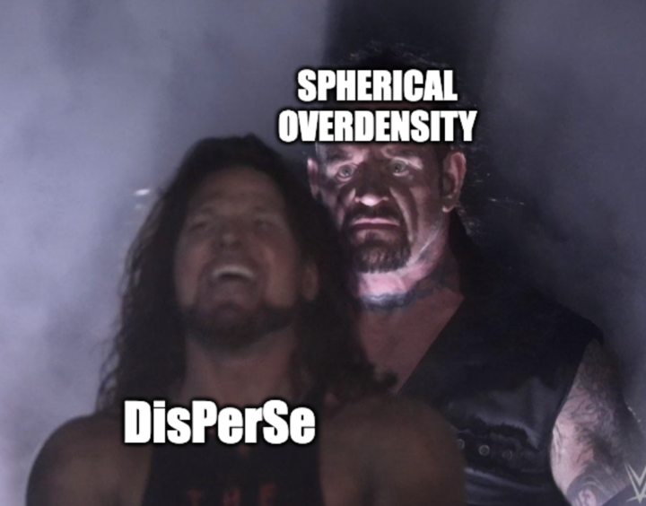

To preface all of this, this work, consisting of two projects, was led by the incomparable [John F. Wu](https://jwuphysics.github.io/) at STScI/JHU, and it was a joy to work with him on this! Now on to the research.
The projects were started during the great [KITP program on Data-Driven Astronomy](https://datadrivengalaxyevolution.github.io/), taking my earlier work on the connection between [galaxies and their formation histories](https://astrockragh.github.io/project/mangrove/). A natural follow-up question is whether we can find similar improvements in our modelling of galaxies by exploiting their **environments** instead of their **formation histories**. We therefore dive into the intricate relationship between galaxies, dark matter halos, and their large-scale cosmic environments using data from the Illustris TNG300 hydrodynamic simulation. To better understand these connections, we tested two machine learning (ML) models: Explainable Boosting Machines (EBMs) and E(3)-invariant graph neural networks (GNNs). We use GNNs to make sure that we capture the full information in the cosmic web, instead of realying on summary statistics, an approach which we know did not work for analyzing formation histories! The E(3)-invariance, means that the functions we learned are made explicitly invariant to [**E**uclidean transfomations](https://en.wikipedia.org/wiki/Euclidean_group) in **3**D, meaning all translations, rotations, and reflections in 3D.

One of the main issues with analyzing environments is that the connections between different galaxies are not given _a priori_. We therefore must pick a subjective length scale, within which we consider galaxies "connected". We must then tune this **linking length** (L), to give us the best results, and see what we can learn from this tuning. In the below plot, I show how graph structures that result from changing linking lengths.

We now test our GNNs and our EBMs with a summary statistic that summarizes information on the same length scale as that used by the GNN. The summary statistic we choose is the _spherically averaged overdensity_, in simple terms, the total amount of mass within a ball of radius L, centered on each galaxy. In summary we have two model, trained to predict the **stellar masses** starting from **dark matter**, the GNN using the dark matter halo, and those around it, and the EBM using the halo and the total amount of mass around it. Differences between the two are therefore only due to treatments in environment. The plot below shows our results as a function of linking length. The y-axis shows the reconstruction **error**, so lower is better!

First, we see that the GNN (purple) is way better than anything else, including the EBM (blue)! So once again, summary statistics are not the way to go, and GNNs are really powerful! However, there is also interesting structure in the plot. The GNN keeps getting better with each increase of the linking length **at the same rate** until at 3 Mpc, and then it levels off, but to another fixed rate! There seems to be something special about this length scale, since the behaviour of our model is essentially in one mode below 3 Mpc, and another above! 

If we look at the performance of the EBM, we also see a conspicuous curve with its best performance at a ***the same length scale!***. The 3 Mpc scale is clearly special!

However, it's also worth noting that the GNNs were able to pick up on environmental influences from larger scales—up to 10 Mpc—showing that there’s more to the galaxy–halo connection than just nearby density.

One thing that we found quite amusing while doing this project was that many people who work with the cosmic web (large-scale positioning of galaxies) were very adamant that we would fail if we did not use this special algorithm called DisPerSE, which is supposed to provide an advanced topological description of the cosmic web, instead of just connecting things within a given length. However, we found that these simple spherical density measures were more useful than more complex cosmic web distance features derived from the DisPerSE algorithm (green line in the above plot).

