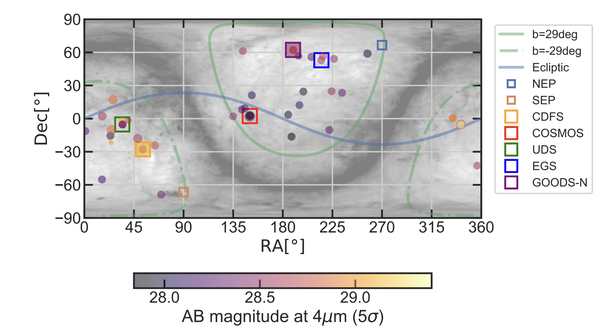

Insert some overview and hyperlinks to the different sections here

# The physics of galaxies in the baby Universe

State-of-the-field, ultra high redshfit galaxy abundances being a tough thing to reproduce theoretically. (below is figure 11 from https://arxiv.org/pdf/2505.11263, cite this)

What models have been proposed so far to mitigate this. Focus on the most popular ones, meaning the bursty star formation and the feedback free model, which appropriate links and citations (for example https://arxiv.org/pdf/2305.02713, https://arxiv.org/pdf/2303.04827).

Now a section on how these are all tuned to reproduce the luminosity or stellar mass functions starting from halo masses (the halo mass function HMF being the only thing we have down theoretically)

# So how can we know which model is right? Clustering!

Section on how we can measure clustering

## The traditional method - Halo Occupation Distribution

See Paquereau+ 2025 for the application in COSMOS-Web. "Given a random galaxy in a location, the 2-point correlation function describes the probability that another galaxy will be found within a given distance." (I want some kind of demonstration figure/video)

However, JWST is almost perfectly constructed to not be able to measure correlation functions well, due to the small field of view. That's because correlation functions require continuous large volumes surveyed. Only one survey really allows us to do so, the COSMOS-Web survey. Include a description of the COSMOS-Web survey (area, depths, combination with cosmos_2020) 

## The new method - Cosmic Variance

While JWST is ideally unsuited for 2 point correlation functions and classical clustering analyses, we just need to be a little creative and come up with new ways of measuring clustering. Our new method leverages another consequence of high clustering --- that the number counts of galaxies between different fields vary increasingly with increasing clustering amplitudes. This clustering-induced field-to-field variance is known as **cosmic variance**, and it is something [I have worked on extensively](https://astrockragh.github.io/project). In short, it makes the amount of galaxies in a given field more dispersed, so that some fields are basically empty, whereas others host enormous amounts of galaxies. You can see a demonstration of how increasing clustering variance gives a higher two-point function amplitude and more dispersed number counts in simulated fields in the Figure below.

--- Figure showing two-point correlation functions, Number count histograms and simulated fields for 3 differnt clustering strengths.

Therefore, if we have enough sampled independent fields, we can directly **measure** the clustering amplitude . Luckily, JWST __IS__ ideally suited to this kind of observation through what is called the pure-parallel observing mode. 

#### Techinal Notes - The Likelihood Function

#### Relationship to other concepts - are we just reinventing old ideas?

For example, Coles and Jones 1991 (https://articles.adsabs.harvard.edu/pdf/1991MNRAS.248....1C), for generating log-normal fields, and saying that one can derive galaxy biases from these fields. (This paper also contains a great ssection on how to simulate realistic galaxy fields given some clustering amplitude/structure!)

This also should include the book by Peebles 1980 and the Adelberger et al. 1998 paper on the Counts-in-Cells statistics of clustered galaxy fields.

Newman and Scott 1952 https://articles.adsabs.harvard.edu/pdf/1952ApJ...116..144N where it is established that the counts-in-cells of galaxies has a super-Poissonian variance due to clustering from gravity.

Void probability functions are another spin on exactly this same thing, but of course the inverse.

One-point statistics for constraining cosmology by Cora Uhlemann's recent work (e.g., [this nice paper from 2020](https://ui.adsabs.harvard.edu/abs/2020MNRAS.495.4006U/abstract)). One-point/counts-in-cells functions are apparently really good at constraining the neutrino mass!

And [this wonderful paper by Brant Robertson](https://ui.adsabs.harvard.edu/abs/2010ApJ...716L.229R/abstract) which quite literally suggests the exact same thing that we ended coming up. It is an amazing paper, and made a lot of the points that we ended up fumbling our way to. E.g., you need to compare to simulations, for these small fields analytic theory does not work very well, you're biased low if you do the same thing by chopping up continuous fields, many great things! Overall I just love this paper, and the method has been severely underrated and underutilized. 

Other papers worth mentioning are López-Sanjuan et al. 2015 (https://www.aanda.org/articles/aa/pdf/2015/10/aa26731-15.pdf) and Cameron et al. 2019 (https://academic.oup.com/mnras/article/483/2/1922/5173113), which also measure galaxy clustering amplitudes using the cosmic variance/counts-in-cells method in the ALHAMBRA and BoRG surveys, respectively. 

So what is the novelty for us? Well, we push the highest-z applications from z~2 to z~10, giving the first ever z ≥ 10 measurement of the galaxy clustering amplitude, and it is the first time that this method has been used with JWST. Furthermore, we find some really interesting tensions that I'll show now!

# So now, what do we then actually measure in the real Universe?

So now we have two independent methods for measuring clustering, which can be applied to two independent datasets. That means that we should be able to combine any conclusions drawn from these analyses. Let's take a look at what we get!

## Traditional clustering method

Below, I show the results that we derived [using a traditional HOD approach in the COSMOS-Web survey](https://ui.adsabs.harvard.edu/abs/2025A%26A...702A.163P/abstract). There is a lot of information on this plot, so let us take a look at the most important parts.

1. Our measurements are shown in ... 
2. The relevant models to look 

[Figure showing the measured clustering amplitude in COSMOS-Web](/project/measuring_clustering_cosmic_variance/COSMOS_clustering_results.png)

## Cosmic Variance method

# What does this mean for galaxy physics?

They cannot be bursty

# What now?

JWST will continue on being an incredible discovery machine, and PANORAMIC is not the only pure parallel survey out there

Another thing is that we need to extend and validate the framework at lower redshift, so that we can also connect clustering at all redshifts, measured from both of these independent methods

## Public Code?

I am very sorry to say ***not yet***, but once the paper is officially accepted, I will release the full analysis code on [my GitHub](https://github.com/astrockragh/), including a demo notebook with simulated data! I unfortunately cannot share collaboration data myself, but I will make the methodology as accessible as possible. On that note, please reach out to me if you have any questions, or if you would like help  

---
