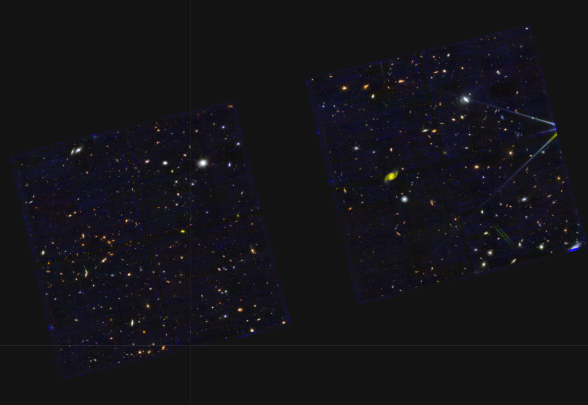

One of the most exciting things happening in astronomy right now is the amazing and unexpected abundance of galaxies in the extremely early Universe, what we call **Cosmic Dawn**!

This post summarises two recent papers on measuring galaxy clustering at Cosmic Dawn and what it tells us about how early galaxies form. I will start with the [big picture](#the-physics-of-galaxies-in-the-baby-universe) of why the early Universe is so puzzling right now, then walk through [why clustering helps](#so-how-can-we-know-which-model-is-right-clustering) and the two independent methods we use --- the [traditional HOD approach](#the-traditional-method---halo-occupation-distribution) and a [new technique based on cosmic variance](#the-new-method---cosmic-variance). [Our results from both methods](#so-now-what-do-we-then-actually-measure-in-the-real-universe) point in the same direction, which has [important implications](#what-does-this-mean-for-galaxy-physics?) for what kind of physics are relevant in the baby Universe. In the end I'll give some [thoughts on what comes next](#what-now).

The two papers are [Weibel & Jespersen et al. (2025)](https://ui.adsabs.harvard.edu/abs/2025arXiv251214212W/abstract) and [Paquereau et al. (2025)](https://ui.adsabs.harvard.edu/abs/2025A%26A...702A.163P/abstract).

# The physics of galaxies in the baby Universe

JWST has, by now, been staring at the distant Universe for a few years, and the picture that has emerged is pretty striking. At the highest redshifts we can probe --- $z \gtrsim 10$, meaning we are looking at galaxies as they were less than ~500 million years after the Big Bang --- there are simply far more bright galaxies than anyone predicted before launch. Not a little more. In some regimes, the observed number densities exceed pre-JWST models by factors of ten or even a hundred.[^1]

The figure below, adapted from [Naidu et al. (2025)](https://arxiv.org/abs/2505.11263), shows this nicely. The shaded bands are various pre-JWST models, and the data points sit well above almost all of them. Post-JWST models (coloured lines) have been tuned to match, but the spread between them is enormous --- they invoke very different physics to arrive at similar luminosity functions.


So what is going on? Why are there so many bright galaxies this early? The community has converged on a handful of plausible explanations, and here, I want to focus on the two most popular ones.

The first is **bursty (or stochastic) star formation**. The idea, developed in detail by [Sun et al. (2023)](https://arxiv.org/abs/2305.02713) among others, is that early galaxies do not form stars at a steady rate but instead go through dramatic bursts and lulls. During a burst, a galaxy can briefly shine much brighter than its time-averaged luminosity would suggest. Since we select galaxies by their UV brightness, we are preferentially catching them at the peak of a burst, and this selection effect naturally inflates the observed luminosity function. In the figure below (from Sun et al.), you can see how a single simulated galaxy flickers in and out of detectability as its star formation rate swings up and down.


<!-- https://www.youtube.com/watch?v=Ewn_zA0xm5Y -->

The second is the **feedback-free starburst** model proposed by [Dekel et al. (2023)](https://arxiv.org/abs/2303.04827). Here, the argument is physical rather than statistical: at the extremely high gas densities and low metallicities characteristic of $z \gtrsim 10$, the free-fall time of the gas is so short that stars form before massive stellar winds and supernovae have time to kick in. Without this feedback, star formation is far more efficient, and galaxies naturally end up brighter than conventional models predict.

Both of these models (and several others[^2]) can be tuned to reproduce the observed UV luminosity function. This is because the luminosity function is essentially a one-point statistic --- it tells you *how many* galaxies there are at a given brightness, but not *where* they are relative to each other. All models start from the same theoretical backbone, the dark matter halo mass function (HMF), which we understand well from simulations and analytic theory. They then apply different prescriptions for how galaxies populate halos. Because we only constrain the total number of galaxies, many different galaxy-halo connections can produce the same luminosity function while predicting very different spatial distributions.

That degeneracy is what makes this problem so hard --- and so interesting.

### Some quick terminology definitions

When we talk about bursty star formation, the terms highly variable star formation, or stochastic star formation are often used interchangeably. Because we are not consistent with these choices in the literature, I will likewise use them interchangeably. However, I do want to note that things can be bursty or highly variable without being stochastic. Stochastic is how we usually make the models we have right now, but there are many ways of making something variable without making it stochastic.

# So how can we know which model is right? Clustering!

If the luminosity function alone cannot distinguish between models, we need a second observable. Galaxy clustering is a natural candidate, because different galaxy-halo connections leave different imprints on the spatial distribution of galaxies. In short: if the bright galaxies we see live in massive, rare halos (as in the feedback-free or high-SFE picture), they should be *strongly* clustered, since massive halos are strongly clustered. If instead the bright galaxies are low-mass systems caught during a stochastic burst, they should be *less* clustered, because lower-mass halos are more common and more uniformly distributed. Clustering directly probes which halos host the galaxies we observe, and that is exactly the lever we need to break the degeneracy.

## The traditional method - Halo Occupation Distribution

The classical way of measuring clustering is through the two-point correlation function. Given a galaxy at some location, the two-point correlation function quantifies the excess probability of finding another galaxy within a given distance, compared to a random distribution.[^3] You can get an intuitive feel for what this looks like in the video below.

<video width="640" height="480" controls>
  <source src="Two-point-correlation-function-astronomy_trimmed.mp4" type="video/mp4">
</video>

Once you have a measured correlation function, you can interpret it through a **Halo Occupation Distribution** (HOD) framework, which parametrizes the average number of galaxies per halo as a function of halo mass. Fitting an HOD to the data lets you infer the characteristic halo masses that host your galaxy sample, and from there the implied star formation efficiency and clustering amplitude.

However, JWST is almost perfectly designed to *not* be able to measure correlation functions well. The issue is the small field of view. Correlation functions require large, continuous volumes to get enough galaxy pairs at all relevant separations, and most JWST surveys cover tiny patches of sky. There is really only one JWST survey large enough: [COSMOS-Web](https://cosmos.astro.caltech.edu/), which mapped 0.54 deg$^2$ with NIRCam across four filters (F115W, F150W, F277W, F444W), reaching 5$\sigma$ point-source depths of ~27.5--28.2 mag.[^4] COSMOS-Web also benefits from the incredible multi-wavelength legacy of the COSMOS field, with deep ground-based and HST data enabling robust photometric redshifts.


[Paquereau et al. (2025)](https://ui.adsabs.harvard.edu/abs/2025A%26A...702A.163P/abstract) used exactly this dataset to carry out the first mass-limited angular clustering measurement all the way out to $z \sim 12$ in a single, self-consistent analysis. Their HOD fits show that at $z > 8$, the measured clustering amplitude is consistently high --- galaxies at these redshifts live in massive halos and are forming stars efficiently. This is the first of our two independent tests of galaxy formation models, and I will show the results [below](#traditional-clustering-method).

## The new method - Cosmic Variance

While JWST is poorly suited for two-point correlation functions and classical clustering analyses, we just need to be a little creative and come up with new ways of measuring clustering. Our new method leverages another consequence of high clustering --- that the number counts of galaxies between different fields vary increasingly with increasing clustering amplitudes. This clustering-induced field-to-field variance is known as **cosmic variance**, and it is something [I have worked on extensively](https://astrockragh.github.io/project). In short, it makes the number of galaxies in a given field more dispersed, so that some fields are basically empty, whereas others host enormous amounts of galaxies. You can see a demonstration of how increasing clustering gives a higher two-point function amplitude and more dispersed number counts in simulated fields in the figure below.

<!-- --- Figure showing two-point correlation functions, Number count histograms and simulated fields for 3 different clustering strengths. -->


Therefore, if we have enough sampled fields, we can directly **measure** the clustering amplitude. One thing worth noting is that the above figure is just for demonstration --- if you want to actually make this measurement, your fields need to be so spatially separated that they are **independent**. Luckily, JWST __IS__ ideally suited to this kind of observation through what is called the pure-parallel observing mode. Essentially, the telescope can operate more than one instrument at the same time, and parallel mode simply means that we ask for our best camera for high-redshift science, NIRCam, to be opened while another primary instrument is in use. The [PANORAMIC survey](https://panoramic-jwst.github.io/) is exactly this kind of survey! Below you can see the PANORAMIC logo and how the different pointings are spatially distributed across the sky.


Because of this survey strategy, we now have __independent__ fields spread all over the sky, perfect for doing the kind of science we want to do! You can also see a randomly sampled PANORAMIC pointing  (out of ~35)(right below here.



#### Technical Notes - The model, the likelihood function, and what we are actually fitting

This section will touch on the formal and mathematical aspects of how to fit for the cosmic variance from a set of fields. Feel free to skip if you are looking for the scientific interpretation of our results! To get to the results we need

- a set of $k$ fields with a set of associated galaxy number counts $\{N_0, N_1, ..., N_k\}$. These should be completeness-corrected before you start doing anything!
- a distribution characterised by a mean and variance ($\mu, \sigma^2$). The distribution has to fulfill a few conditions:
  1. It has to approximate the Poisson distribution in the limit of $\sigma^2 \rightarrow \mu$, the appropriate distribution when no clustering is present.
  2. It has to allow for $\sigma$ to be set independently of $\mu$, allowing $\sigma$ to encode the clustering strength at a fixed mean number density.
  3. It has to be strictly positive.

  A few different distributions fulfill these conditions, but the two best are the Gamma distribution and the Negative Binomial. Using either of these is fine, and it does not impact the results we get. I typically use the Gamma, but it does not matter.

- A likelihood function. Given our chosen distribution $p(N \mid \mu, \sigma)$, the log-likelihood for the full set of fields is simply the sum of the individual log-probabilities: $\ln \mathcal{L}(\mu, \sigma) = \sum_{i=1}^{k} \ln\, p(N_i \mid \mu, \sigma)$. However, instead of the traditional Poisson likelihood, we adopt a Negative Binomial likelihood which is less sensitive to outliers.

- A way of fitting. Since $\mu$ and $\sigma$ are non-linearly related, and because we want proper posteriors rather than point estimates, the ideal way is to use an MCMC sampler. This can be implemented using the excellent ```emcee``` package.[^5] One can prove that for a Maximum Likelihood Estimator, the cosmic variance is always biased high (see [Jespersen et al. 2025a](https://ui.adsabs.harvard.edu/abs/2025ApJ...982...23J/abstract)), and although I have not formally proven that the MCMC approach removes this bias, I suspect that having proper priors and marginalisation helps substantially.

#### Relationship to other concepts - are we just reinventing old ideas?

The honest answer is, as so often in science, kind of. The idea that galaxy counts in cells carry clustering information is quite old. [Newman & Scott (1952)](https://articles.adsabs.harvard.edu/pdf/1952ApJ...116..144N) already established that the counts-in-cells of galaxies should have a super-Poissonian variance due to gravitational clustering, and this was formalised further in Peebles' classic textbook.[^6] [Coles & Jones (1991)](https://articles.adsabs.harvard.edu/pdf/1991MNRAS.248....1C) showed that one can generate realistic log-normal galaxy fields from a given clustering amplitude and derive galaxy biases from these fields (their paper also has a wonderful section on simulating realistic clustered fields, which I have drawn on quite a bit for demonstrations). Void probability functions are another spin on exactly the same idea, but of course the inverse.

More recently, [Cora Uhlemann and collaborators](https://ui.adsabs.harvard.edu/abs/2020MNRAS.495.4006U/abstract) have shown that one-point/counts-in-cells statistics are surprisingly powerful for constraining cosmology, including the neutrino mass. And in the observational sphere, [López-Sanjuan et al. (2015)](https://www.aanda.org/articles/aa/pdf/2015/10/aa26731-15.pdf) and [Cameron et al. (2019)](https://academic.oup.com/mnras/article/483/2/1922/5173113) measured galaxy clustering amplitudes using the cosmic variance/counts-in-cells method in the ALHAMBRA and BoRG surveys, respectively, but at much lower redshift, and in quite different fields.

Finally, there there is [this wonderful paper by Brant Robertson (2010)](https://ui.adsabs.harvard.edu/abs/2010ApJ...716L.229R/abstract), which quite literally suggests the exact same thing we ended up doing. It is an amazing paper, and made a lot of the points that we ended up fumbling our way to independently: that you really should compare to simulations to be safe; the fitting should be done with MCMC; you are biased low if you chop up a single continuous field rather than using truly independent sightlines; many great things! Overall I just really like this paper, and the method has been severely underrated and underutilised.

So what is the novelty for us? We push the highest-$z$ applications from $z \sim 2$ all the way to $z \sim 10$, giving the first-ever $z \geq 10$ measurement of the galaxy clustering amplitude, and it is the first time that this method has been applied to JWST data. Furthermore, we find some really interesting tensions that I will show now, so I would argue that the method is really coming into its own!

# So now, what do we then actually measure in the real Universe?

We now have two independent methods for measuring clustering, which can be applied to two independent datasets. That means that we should be able to combine any conclusions drawn from these analyses. Let's take a look at what we get!

## The Traditional Clustering Method

Below, I show the results that we derived [using a traditional HOD approach in the COSMOS-Web survey](https://ui.adsabs.harvard.edu/abs/2025A%26A...702A.163P/abstract). There is a lot of information on this plot, so let us take a look at the most important parts.

1. Our measurements are shown as filled circles with errorbars connected by solid lines. Each colour shows a different mass bin.
2. The relevant model comparison is to look at the dashed (bursty star formation model) and dash-dotted (no burstiness) lines. These are also calculated per mass bin, so compare only data and model lines with the same colour.
3. Focus specifically on the dark green measurements at $z \sim 9$. It is easy to see the tension between our measurement and the bursty model, as well as the near-perfect agreement between the measurements and the model with no burstiness.


The cyan measurements are also interesting, but here the model comparison is less obvious and the measurements more uncertain, although the clustering is still consistently high.

In total, at $z \sim 9$, we get a tension between the data and the bursty model of $\approx 3\sigma$. This is substantial and exciting, but it did not fully convince me at first. I did not feel certain that it was not some weird model systematic driving these results, although the signal was pretty clear. That motivated my second direction for constraining clustering.

## The Cosmic Variance mMthod

<!-- The cosmic variance method is a much more model-free way of measuring clustering -->
As described [above](#the-new-method---cosmic-variance), we must always jointly fit for both the mean and variance when we fit for the cosmic variance. That means that we always get two-dimensional contours in number density -- clustering amplitude space. This is what you can see in the figure below, along with the pre-JWST expectation clearly marked in red. The question is then how we can move to the higher-than-expected abundance of galaxies without lowering the clustering amplitude. That is because a higher galaxy abundance usually comes associated with lower-mass systems, which are less strongly clustered.


So let's take a look at some of these potential models. I want to specifically highlight
1. the bursty star formation model that you have already heard a lot about, and
2. a model that one of my favourite collaborators, [Rachel Somerville](https://www.simonsfoundation.org/people/rachel-somerville/), introduced[^7], which scales the star formation efficiency with halo mass (**D**ensity **M**odulated **S**tar **F**ormation **E**fficiency, DMSFE), so that higher-mass systems preferentially form the galaxies we see.

Below, you see how these models move us across the number density -- clustering contours. While there is no enormous difference between them, the bursty model systematically underpredicts the clustering amplitude relative to the Somerville/DMSFE model.


Because the differences are systematic, we can aggregate the results across the three UV magnitude bins (after making them statistically independent) to get a consistent and somewhat strong result. This is what is shown in the figure below, where we also tested many other models, as well as variations on the above (each model class has a letter, variations are numbered).


So in total, between the bursty and DMSFE models, we find that burstiness is disfavoured at the $\approx 2\sigma$ level. Again, on its own this is not very impressive. In physics we do not take $2\sigma$ to be definitive, but merely suggestive of tension. This reflects the fact that we are making a very model-independent statement (any time we are not using a very specific model, it tends to lower the significance of the finding), and that we simply do not --- for the time being --- have that much data in this novel and exciting early Universe regime. However, the high biases can still be used to constrain galaxy formation models! However, speaking of the high bias...

#### Why are you measuring a galaxy bias of 100??

One thing that surprised me a bit: once we mapped our measured cosmic variance values to a galaxy bias (i.e., how much more clustered galaxies are than dark matter, $b_g = \sigma_{\rm CV}/\sigma_{\rm DM}$), we find very high values on the order of 100. This worried us quite a lot, since bias values closer to 1 are much more normal, at least in the local Universe. However, two things are in effect:

1. At high redshift, galaxies are inherently more biased, with bias values on the order of 10 being expected. So this gets us half the way.
2. Our fields are quite small, meaning that we are not measuring the typical _linear_ bias, but instead a _non-linear_ bias, which is boosted at small scales. We tested if this was really the case in the ```UniverseMachine``` simulation, and as you can see in the figure below, we would have gotten the same bias as the usual clustering studies if each of our fields was roughly a square degree in size. However, our fields are only around 1/500th of that size, which is why the values look so extreme.


## Putting both tests together

Because we now have two tests, based on two different sets of assumptions, applied to two different datasets, we can straightforwardly combine them to get the joint significance. For this, we can either combine the Gaussian tensions directly, or use [Fisher's Method](https://en.wikipedia.org/wiki/Fisher%27s_method), which implicitly accounts lightly for the [look-elsewhere effect](https://en.wikipedia.org/wiki/Look-elsewhere_effect). That is what the plot below shows for the DMSFE and bursty models.


Here we see that the total preference for a non-bursty model is just below $4\sigma$ (depending on how we aggregate the probabilities). We are thus already getting close to the $4\sigma$ threshold that [in medicine](https://nursing.ucalgary.ca/research/nursing-research-office/data-analysis/quantitative) would be called "extremely strong evidence against the null hypothesis". That is maybe a little stronger than I am willing to put it, but the point stands: $4\sigma$ is significant.

# What does this mean for galaxy physics?

So in the end, the otherwise very popular bursty model seems fairly ruled out. Galaxies in the early Universe cannot be very bursty --- they do not go through a "wild teenage phase". Instead, **galaxy growth must tightly follow the growth of their host dark matter halos**. We also find that the efficiency of star formation must scale with the mass of the host halo, in line with the DMSFE picture.

This has some interesting implications. If burstiness is not the main driver of the bright end of the luminosity function at Cosmic Dawn, then the galaxies we see really are as massive and as actively star-forming as they appear. That puts serious pressure on our understanding of how quickly gas can be converted into stars in the first few hundred million years, and it makes the case for physically motivated models --- where the star formation efficiency itself is enhanced in the most massive halos --- considerably stronger. It also means that the galaxy-halo connection at $z \gtrsim 10$ is likely tighter and more deterministic than at lower redshifts, which is a prediction that future observations should be able to test directly.

# What now?

There are two obvious frontiers. The first is on the measurement side: get more data, validate our methods, and push the precision of high-$z$ clustering constraints. The second is more conceptual: figure out how to reconcile what clustering tells us with what galaxy spectra seem to be saying. Let me take these in turn.

### Improving our methodology and measurements

JWST will continue being an incredible discovery machine, and PANORAMIC is not the only pure parallel survey out there. We should all combine our forces and pool our data to get the sample sizes we need for truly precise clustering constraints at $z > 10$. More fields, more sightlines, more statistical power. If the JWST Time Allocation Committee recognises how valuable this is, we may get to triple or quintuple the number of independent sightlines quite soon --- fingers crossed!

Beyond just adding data, we need to seriously validate these tools at lower redshift. Right now, the cosmic variance method has only been applied in this high-$z$ regime, and even the HOD framework has never been stress-tested in simulations at $z > 8$. Extending both methods down to $z \sim 4$--$6$, where we have much better statistics and complementary spectroscopic data, would let us cross-check the two approaches against each other and against existing results. That kind of validation is essential before we can fully trust what either method tells us at the frontier.

We should also think about applying these tools to different galaxy populations --- for instance, splitting by UV colour or morphology --- to see whether the clustering signal depends on galaxy properties beyond luminosity. That would give us a much richer picture of the galaxy-halo connection at Cosmic Dawn --- but for that we need more data.

### Reconciling clustering with spectral indicators of burstiness

This is, to me, the most interesting open question. At the Aspen conference earlier this year (early March 2026), it became very clear that there are two fairly disjoint sections of the community studying burstiness, and they are reaching opposite conclusions. Those of us measuring clustering see high clustering amplitudes that are hard to square with strong stochastic variability in star formation. Meanwhile, people studying the UV-to-H$\alpha$ luminosity ratios of individual galaxies see exactly the kind of scatter you would expect from bursty star formation histories --- elevated H$\alpha$ relative to UV in many systems, and very wide distributions in those ratios, consistent with recent and high-amplitude bursts of star formation on ~10 Myr timescales.

Both of these results seem robust on their own terms. So either one of the measurements has a systematic we do not yet understand, or the answer is more subtle than "bursty vs. not bursty". It is going to be really exciting to figure this out! I want to especially thank Daniel Stark, who really pressed me on this at Aspen and inspired me to take this tension more seriously.

There is already some early theoretical work pointing in this unified direction. [Muñoz et al. (2026)](https://arxiv.org/abs/2601.07912) recently put out a very nice paper arguing for exactly this kind of mass-dependent burstiness, and I think it is the right way forward. Their analysis suggests that clustering may not be very sensitive to burstiness if it is purely halo-mass-dependent, but from clustering only, we disagree quite strongly. Our updated clustering measurements also carry more constraining power than what is assumed in that work, and the cosmic variance method in particular is sensitive to exactly where the distinction matters most. I plan to visit UT Austin in the fall, and one of the main motivations is that I am very much looking forward to figuring this out properly with Julian.

## Public Code?

I am very sorry to say ***not yet***, but once the paper is officially accepted, I plan to release the full analysis code on [my GitHub](https://github.com/astrockragh/), including a demo notebook with simulated data. I unfortunately cannot share collaboration-reduced data myself, but I will make the methodology as accessible as possible. Please reach out if you have any questions, or if you would like help setting up a similar clustering measurement for your own survey.

---

[^1]: See the spectroscopic confirmation of a galaxy at $z = 14.44$ in [Naidu et al. (2025)](https://arxiv.org/abs/2505.11263), where the implied number density exceeds pre-JWST consensus models by a factor of ~100--200.

[^2]: Other proposals include a more top-heavy IMF at early times, reduced dust attenuation, contributions from AGN, and various combinations of the above. See [Naidu et al. (2025)](https://arxiv.org/abs/2505.11263) for a recent compilation.

[^3]: More formally, given the mean number density $\bar{n}$, the probability of finding a galaxy in a volume element $dV$ at distance $r$ from a known galaxy is $dP = \bar{n}[1 + \xi(r)]\,dV$, where $\xi(r)$ is the two-point correlation function.

[^4]: COSMOS-Web is a 255-hour Cycle 1 treasury program; see [Casey et al. (2023)](https://ui.adsabs.harvard.edu/abs/2023ApJ...954...31C/abstract) for the survey design.

[^5]: [Foreman-Mackey et al. (2013)](https://ui.adsabs.harvard.edu/abs/2013PASP..125..306F/abstract). If you do Bayesian inference in Python and have not used ```emcee```, you are missing out.

[^6]: Peebles, P. J. E., *The Large-Scale Structure of the Universe*, Princeton University Press, 1980.

[^7]: [Somerville et al. (2025)](https://arxiv.org/abs/2505.05442). The DMSFE model incorporates a scaling of star formation efficiency with gas surface density, motivated by cloud-scale simulations.
