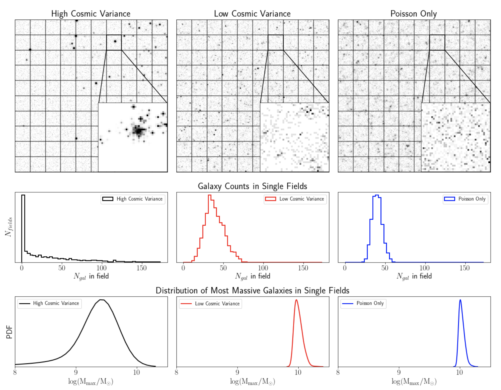
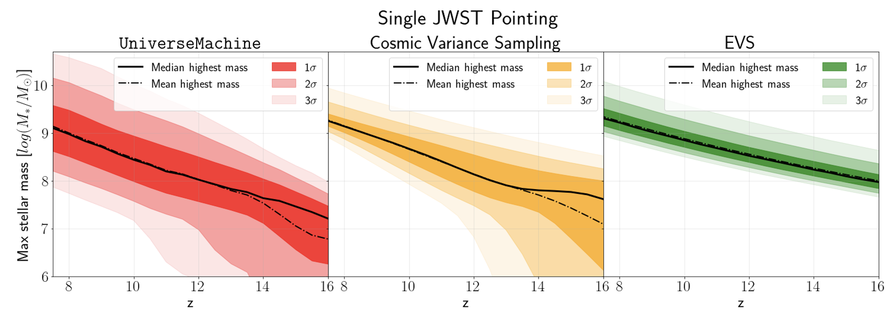
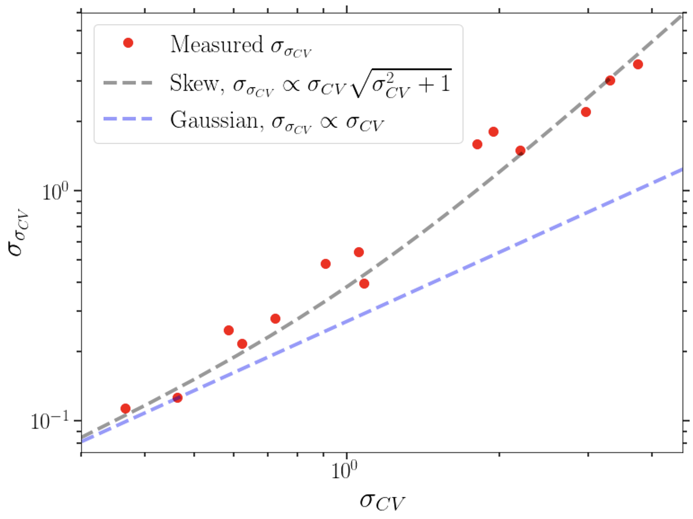
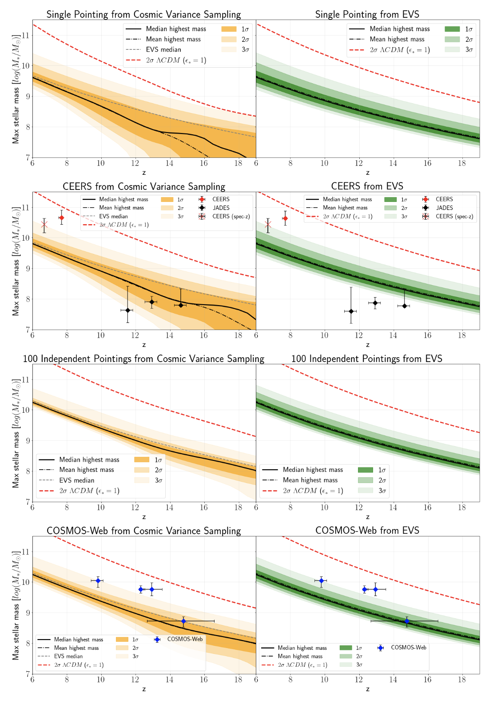

Building on [previous work](https://ui.adsabs.harvard.edu/abs/2021ApJ...923....8S/abstract) where we investigated the impact of cosmic variance on the probability of finding a single, ultra-high redshift galaxy, we now turn to the question of the mass of the most massive object in a given observed field. This was motivated by the [surprising abundance of massive objects observed with JWST](https://ui.adsabs.harvard.edu/abs/2023ApJ...946L..13F/abstract), which challenged all galaxy formation models and even had some people questioning our cosmological model. However, the first analyses of this potential tension was done without much regard for potential subleties, something we attempted to mitigate in this paper. A major issue with many studies is that they often overlook an important factor: **cosmic variance**. This refers to the uneven clustering of galaxies across different parts of the sky (see the above figure), which causes the number of galaxies observed in a given area to vary more than you’d expect from simple Poisson statistics. In essence, certain regions may systematically have more or fewer galaxies just because of where you're looking, and this systematic is a **big** effect in the very early universe.

Cosmic variance becomes even more pronounced when you look at galaxies that are very massive, at high redshifts, or when observing small areas of the sky — just like in the deep surveys conducted by JWST. These narrow and deep surveys targeting the earliest, most massive galaxies, are especially vulnerable to the effects of cosmic variance.

In this paper, we developed a model to predict the distribution of mass of the most massive galaxies in given JWST surveys, taking the cosmic variance into account. The model shows that previous methods, which relied on [idealized Extreme Value Statistics](https://arxiv.org/abs/2208.10479), don’t fully capture the actual distribution. Instead, the new predictions reveal some surprising differences, both in the position and shape of the distribution of the largest galaxies, as can be see. The results were a little counterintuitive at first, but upon further reflection, they offer a more accurate picture of what we should expect to (and do) find in these surveys! This is shown in the below figure, where the yellow contours (including cosmic variance) can clearly be seen to greatly diverge from the green contours (no cosmic variance), at high redshift.

To test the models validity, we used simulations from [UniverseMachine](https://arxiv.org/abs/1806.07893) (see the red contours in the figure above), an empirically calibrated tool designed to simulate galaxy formation in the universe. Sure enough, the predicted effects of cosmic variance stood out clearly, showing that it has a major impact on the most massive galaxies we may observe, in exactly the way our simple model predicted!

Another key finding was that cosmic variance estimators are affected by a "variance on the variance" in a way that has so far been neglected. The uncertainty in the cosmic variance itself is highly non-Gaussian in the limit where the cosmic variance itself is high, and we both prove it and empirically measure the effect. The proof can be checked out in the paper, but the result is shown in the below figure!

Ultimately, the study underscores the importance of properly considering cosmic variance when interpreting the results of galaxy surveys, especially when trying to reconcile the existence of extreme galaxies in the early universe with existing galaxy formation models. Without doing so, we may be misinterpreting the true nature of the early universe. The effects for a few sample cases can be seen below.

