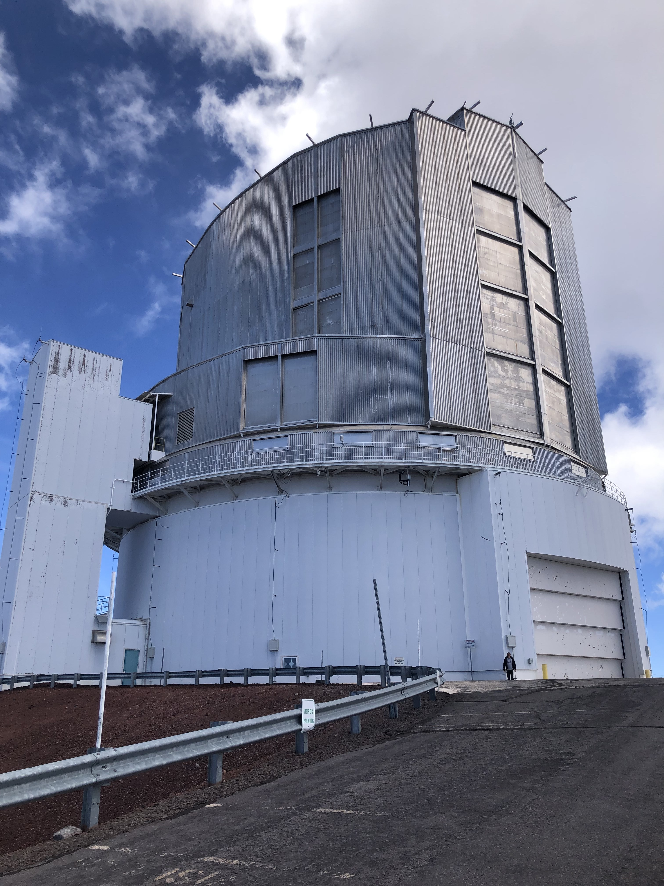

As astronomy pushes towards ever fainter targets, at ever greater distances, in ever greater numbers, we are faced with a new series of problems which need solving.

The two main focus areas for the next generation for surveys are thus 
1) Observing many targets at the same time
2) Increasing the sensitivity to faint targets

The first issue can be solved by multi-object observations. There are many ways of doing this, for example, if all we are interested is in pictures or photometry, we can take a single, ultra-high-resolution picture, and then analyze subdivisions later. This is the approach taken by the [Legacy Survey of Space and Time (LSST)](https://rubinobservatory.org/). However, if we want detailed **spectra** (light split up wavelength with high resolution), the most information-rich data type in astronomy, we must do things differently. 

For the [Prime Focus Spectrograph (PFS)](https://pfs.ipmu.jp/) on the [Subaru Telescope](https://en.wikipedia.org/wiki/Subaru_Telescope), we do [multi-object spectroscopy](https://en.wikipedia.org/wiki/Multi-Object_Spectrometer) using optical fibers. This means that we focus the light from the area we are observing onto 2400 separate points, connected to optical fibers to lead them to our spectrograph. Now we can treat this as 2400 separate spectra, **but we get them all at the same time!** So if we want to take spectra of 2400 galaxies for half an hour each, a series of observations that would previously have taken 100 nights, we just get all of them in the same half hour! So now we can observe many millions of targets.
You can see the focal plane (where we focus the light), with our 2400 fibers, in the picture below. One of the cool things about this is that we need to be able to move the fibers a bit to get them to follow the targets we want to observe, and this is done by tiny robots, called cobras. A cool video of them moving can be found by [clicking this link](https://pfs.ipmu.jp/instrumentation.html).


So now we know that we can observe a lot of galaxies. How about 2)?
The first you want to do is to get a big telescope! With PFS, we are lucky to have access to the very large [Subaru Telescope](https://en.wikipedia.org/wiki/Subaru_Telescope), situated on Mauna Kea at an altitude of 4,139 m (13,579 ft) in Hawai'i, USA.[^1] When you read very large, it can be hard to understand just how large, so here's a picture of me (~1.8 m/~6ft tall) standing at the bottom of it.



The primary mirror is 8.2 m (320 inches) in diameter, one of the biggest in the world! The area of the mirror is twice that of the [JWST Space Telescope](https://en.wikipedia.org/wiki/James_Webb_Space_Telescope). Building very large telescopes is one of the great advantages of having them on the ground, compared to in space. However, when we are on the ground, we have to deal with one of the things which scare astronomers the most...

:ghost: **The atmosphere** :ghost:

So why is the atmosphere scary? There are three main reasons:

- The atmosphere makes it hard to focus on distant objects. This is because air _moves_, which spreads out the light, so that something coming from a single point gets spread out over a large area.
- The atmosphere absorbs light, making our targets fainter.

And now, the biggest problem for PFS.

- The atmosphere emits light itself, glowing with light we call _airglow_. When we look at anything from the ground, we always observe both the airglow and the target.

The airglow is a problem because airglow is both **bright** and **variable**. Below, you can see an example of a simulated[^2] galaxy spectrum, split up into sky and galaxy counterparts. It is clear that the galaxy is dominated by the airglow. The galaxy shown here is actually quite bright, the main PFS targets will be 100 times fainter, so detecting any galaxy component is really hard! Searching for galaxies from the ground is like searching for a tiny firefly behind a giant stadium light!


One exciting aspect of the airglow is that it actually is the same thing as aurora. In the above plot, the strong lines at 557 nm and 630 nm are actually the green and red light we see during aurora (look at the top of the article!). They are always there, but when we are not being hit by a solar storm, you cannot quite see them with the naked eye. However, as you may already have noticed, most of the airglow comes out in the infrared (IR), so if our eyes could see in the IR (wavelengths above 700 nm), we would have aurora all the time!

While this would definitely be spectacular, it also poses a major problem for ground-based astronomy, as can be seen in the above figure. So in order to observe faint galaxies from the ground, we must get really good at a process known as _sky subtraction_. As the name suggests, this is the process with which we subtract the airglow from our spectra. However, this requires **knowing** how the airglow was at the same time that the observation was taken. This is usually done by taking some of our 2400 fibers and pointing them towards blank pieces of sky. If we let fiber A point at a galaxy, we will observe ```(galaxy+airglow)```<sub>A</sub>, and if we let fiber B point at a blank piece of sky, we will observe ```(airglow)```<sub>B</sub>.
Taking ```(galaxy+airglow)```<sub>A</sub>-```(airglow)```<sub>B</sub> will then give is the clean galaxy spectrum, ```galaxy```<sub>A</sub>. 

Doing this efficiently requires _understanding_ the airglow. Luckily, we are not the first ones to worry about this, but in order to understand the airglow well, we must do some observations of our own. For this, we have built a small auxiliary telescope for Subaru, the Subaru Night Sky Spectrograph (SuNSS). As the name indicates, this telescope is dedicated to observing the airglow only. Because the airglow is so bright, we do not need to utilise a giant telescope, and we instead use two small telescopes with diameters of approximately 35mm/1.5in. These small telescopes are then connected to the same spectrograph as PFS, so except for being much smaller, it is exactly the same system. To give a sense of scale, here are some pictures of SuNSS mounted on what we call the "spider" of Subaru.[^3]


This little telescope has been a close companion of mine since January 2022, thanks to Jim Gunn and Robert Lupton at Princeton who had the idea for the instrument. So let us now summarize some facts about the airglow in the wavelength range we care about (380nm - 1270 nm).[^4]

#### 1) Airglow is dominated by emission from OH molecules, followed by emission from molecular oxygen, then atomic oxygen and sodium.

When we look at the airglow, we can see that most of the airglow comes out in the form of what we call _lines_. This means that the light is only at a specific wavelength, and that why we get this line-like appearance. These narrow lines show up because they come from specific atoms or molecules, and within these, quantum mechanics tells us that only certain energy levels and transitions are possible. So when we go from one level to another, we always observe exactly the same wavelength of light being emitted. The really cool thing about these levels is that they are unique for each atom or molecule, and therefore they serve as _fingerprints_ for molecules and atoms, which lets us identify what exactly is emitting the lines we see. This fingerprint technique is how we pick out that OH, O<sub>2</sub>, atomic oxygen, and atomic sodium are responsible for the emission. Not only do we get to pick out the species, but we see that they behave differently over time! If we look at two spectra of the airglow, taken a few days apart, we can see that the different emitters change very differently with time! In the bottom panel below you see all the OH emission clearly in orange, and everything else in blue.
The atomic oxygen is denoted as NaD (D for doublet) and atomic oxygen is written as OI, which is astronomy jargon for a normal oxygen atom with all of its electrons in place.


Atoms have only a small number of levels, but molecules have a lot, and that is because molecular energy can store energy in a way that atoms can't: they can _vibrate_ and _rotate_. These rotations/vibrations can only happen at certain frequencies, but it opens up a lot more energy levels. That is why the OH and O<sub>2</sub> produce "forests" of lines, whereas the atoms only produce a few. This also means that it is the molecules, and especially the OH, is responsible for **cooling the atmosphere at night!** Since the atmosphere cools through radiation, and most of the radiation comes from OH, that means that the atmosphere is mainly cooling through OH emission!

That means that understanding the airglow is not only very important for astronomy, but also for climatology and climate change. This leads us to the next point!

#### 2) We can measure the temperature of the atmosphere using the airglow.

There are many things that control the emission of a molecule, but one of the most important things is the local temperature. That is because the local temperature dictates which lines are strong and which lines are weak.  If the local temperature is high, there will be more molecules that rotate or vibrate at higher frequencies, so the lines associated with these energy levels will be stronger, and on the other hand, if it is cold, more molecules will rotate/vibrate at low frequencies, so the lines associated with these lower energy levels will be stronger
This also means that we can **measure** this temperature from the relative intensities of the lines. The measurement is only valid for the region that the OH is in, which is between 75-95 km up in the atmosphere, but here, we measure the temperature to be around 190K (-83 C/-117 F). However, this changes throughout the night, usually starting at 200K (-73 C/-99 F), then dropping to around 180K (-93 C/-135 F) right after midnight, before slwoly climbing again. This once again leads us to our next point...

#### 3) The airglow is very variable with time. 

As discussed above, the airglow changes over time. It changes on scales of minutes, hours, days, years, and decades. This is because the atoms and molecules which emit the airglow change their densities and temperatures overnight, as a function of the seasons, and as a function of the solar cycle.
Even over a single night, we observe that most of the components change their intensity by more than 100%, which is why we measure it all the time with SuNSS and PFS. The quick changes are due to changes in the densities and temperature of the atmosphere, which cause the atmospheric layers containing the glowing atoms and molecules to rise and sink overnight. Quick changes can also be due to waves passing through the atmosphere, which compress and heat the atmosphere! We all know this from seeing videos of aurora, where the intensities change quite dramatically over time. All of this is tracked with SuNSS every night, so at the end of its lifetime, we will have a decade of very high-quality data of the upper atmosphere!

#### 4) The airglow is pretty uniform on the night sky.

Another interesting aspect that we determined from observations with SuNSS, is that most of the time, the airglow is quite uniform on scales of less than 1.5km (around 1 mile), so although it changes quite rapidly in time, it does so in a spatially coherent way. We have determined that the intensities are uniform to around 1% on the scales probed by SuNSS and PFS!

#### 5) We can also use the airglow to improve our telescopes.

Although I have mainly focused on the airglow itself, along with the how we get rid of it, we can also **use** the airglow for calibrating our telescopes better! This will be probably be the subject of another post here, since I'm working on a couple of papers on this, but since those are not yet out, I will give a quick description here.

There are two things that we can use the airglow for calibrating, the first is our _wavelengths_. Whenever we move our telescope, everything shifts a little, and that means that the same point on our instrument does not always correspond to the same wavelength of light. We must thus continously recalibrate the wavelengths. As I mentioned above, every molecule and atom has a set of wavelengths that it can emit at, a sort of quantum mechanical wavelength-fingerprint, but if we have already identified the molecules and atoms producing the lines, we can use that fingerprint to calibrate to! Most of the wavelength calibration is done with OH lines, so they serve a crucial purpose! The really nice thing about using the atmosphere to calibrate after, is that it literally is everywhere you look, so you get a calibration source for free. Airglow really is a blessing and a curse.

We can also use the airglow to calibrate the amount of light going through the telescope at different wavelengths, however, this is quite tentative and novel! The idea is that the relative intensities of each line is set by quantum mechanics, so if we can do the quantum mechanics right, we can tune our telescope so that the observed intensity ratios match the theoretical ones. This would solve a lot of problems, so maybe airglow can save us once again!

No matter what, I love the airglow, and I hope that we all get to appreciate it more. To finish off, here is a nice 360-degree picture from next to Subaru, where the beautiful red airglow is obvious in the horizon!


[^1]: Subaru made a really nice promotional video for the Prime Focus Spectrograph, which can be found on this link [https://www.youtube.com/watch?v=usALcInrWVc](https://www.youtube.com/watch?v=usALcInrWVc).
[^2]: I would love to show some real spectra, but since the full PFS spectra are not yet public, I'll stick with the simulated spectra for now.
[^3]: The spider holds the instrument at the primary focus of Subaru, in the pictures showing the position of SuNSS, the spider is the four-pronged thing holding a big cylinder in the middle of a blue ring.
[^4]: Visible light goes from roughly 380-700 nm.