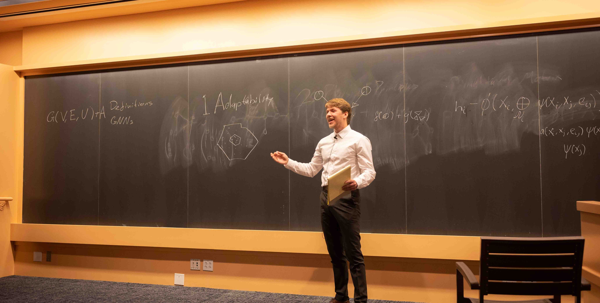

Now that I hold a few different Fellowships across the University of Toronto and CITA, with long-term visiting positions at [Université de Montréal](https://www.umontreal.ca/) (~2 months/year) and [Stockholm University](https://www.su.se/english/) (~1 month/year), I am so excited to collaborate with students across **astronomy, statistics, machine learning, and physics**. Whether you're puzzling over an applied inference problem, trying to make neural networks behave for doing science, or just curious about astrophysics — we can find a lot of common ground. Here you can find some information about possibilities for working with me!

I am very excited to work with graduate students, but you will have to already be in a graduate program, I cannot help with getting you in. However, if you're an undergraduate/bachelor's student, I can! Below, you can find more details.

---

## If you are/want to be graduate student working with me

I unfortunately cannot help with getting you admitted anywhere, but if you're already at UofT or UdeM and you're interested in doing a PhD/MSc project with me, I'm happy to contribute with ideas and supervision! However, you should first apply through:

- **University of Toronto** — [Apply to the Department of Astronomy & Astrophysics](https://www.astro.utoronto.ca/academics/graduate-studies/how-to-apply/) or [the Department of Statistical Sciences](https://www.statistics.utoronto.ca/graduate) or [the Department of Computer Science](https://web.cs.toronto.edu/graduate/prospective)
- **Université de Montréal** — [Apply through the Département de physique / iREx](https://irex.umontreal.ca/en/join-us/)

If you're in any university close by one of the aforementioned universities (e.g., York/McGill), please do also get in touch with me!

---

## Undergraduate/Bachelor's students

One of the things I care most about is giving undergraduates real research experience early. Summer projects are a fantastic way to find out whether you love research — and to build the skills and confidence that open doors later. **I will do everything in my power to make sure that you will be paid for your work.**

Whether you're Canadian or international, here's the short version:

1. **Read about [my research](https://astrockragh.github.io/project/)** — make sure you're excited about at least some of it
2. **Email me** with a short description of your background and what you'd like to work on
3. **Do this early** — ideally **6 months before** the start of your intended project (so in winter if you're going for a summer program), to leave time for funding applications and (for international students) visa logistics
4. We'll have a short cjat to see if there's a good fit

I don't expect you to know that much ***a priori***, but some coding experience and the equivalent of the first year of a physics/astromomy degree will go a long way. But truly, I only expect you to be curious and willing to put in the effort to learn.

---

### 🇨🇦 Canadian Students (especially UofT)

There are several excellent funding mechanisms for Canadian undergraduates to do summer research with me. I strongly encourage you to explore the options below — I can support your application through any of these.

| Program | Eligibility | Link |
|---|---|---|---|
| **NSERC USRA** | Canadian citizens/PRs, ≥ 3.0 GPA | [NSERC](https://www.nserc-crsng.gc.ca/Students-Etudiants/UG-PC/USRA-BRPC_eng.asp) |
| **UofT SURF** | UofT undergrads | [UofT Research Opportunities](https://www.artsci.utoronto.ca/current/academic-advising-and-support/research-opportunities-program) |
| **UofT Research Opportunity Program (ROP)** | UofT students in 2nd year+ | [ROP](https://www.artsci.utoronto.ca/current/academic-advising-and-support/research-opportunities-program) |
| **CITA Summer Undergraduate Research Programme** | Strong physics/math/CS background | [CITA SURP](https://www.cita.utoronto.ca/opportunities/undergraduate/) |

> We cannot make any guarantees, but pay is expected to be on the order of ~$8,000 CAD, with a lot of variance across programs.

**Please contact me at least 6 months in advance** if you're interested — many of these funding applications require lead time and we'll need to plan the project together before submitting. You should also check out the [website of my amazing group leader, Prof. Josh Speagle.](http://joshspeagle.com/#collaboration)

---

## 🌍 International Students — Including a Special Track for Nordic Countries

I am especially enthusiastic about hosting international undergraduate students for summer projects, and I will have some **additional funding** available for students from **Scandinavian countries** (Denmark, Sweden, and Norway) to cover travel, lodging, and salary (think of it as a `studiejob`).

This program was born because that Scandinavian bachelor's students have limited opportunities for research experiences (and zero opportunities to get paid for that work) before they get to the PhD level — and that everybody is missing out because of it. We miss out on a lot of talent, and honestly, the ones who do research anyway are getting exploited a bit since we cannot pay them. I hope this can be one small step toward fixing that.

**What the program covers:**
- ✈️ **Airfare** (Copenhagen/Stockholm ↔ Toronto): ~$900–1,400 CAD
- 🏠 **Lodging** in Toronto for ~10 weeks: ~$4,000–5,000 CAD
- 💰 **Additional Salary**: ~$5,500 CAD take-home

The program will be in its pilot phase (2 students in Year 1), with plans to grow to 4 students per year from Year 2 onward, and to expand to Montréal-hosted positions from Year 3.

**Relevant funding sources I'm pursuing for international students:**
- [Mitacs Globalink Research Award](https://www.mitacs.ca/our-programs/globalink-research-award/)
- [Erasmus+ International Credit Mobility](https://erasmus-plus.ec.europa.eu/)

---

*Last updated: March 2026*